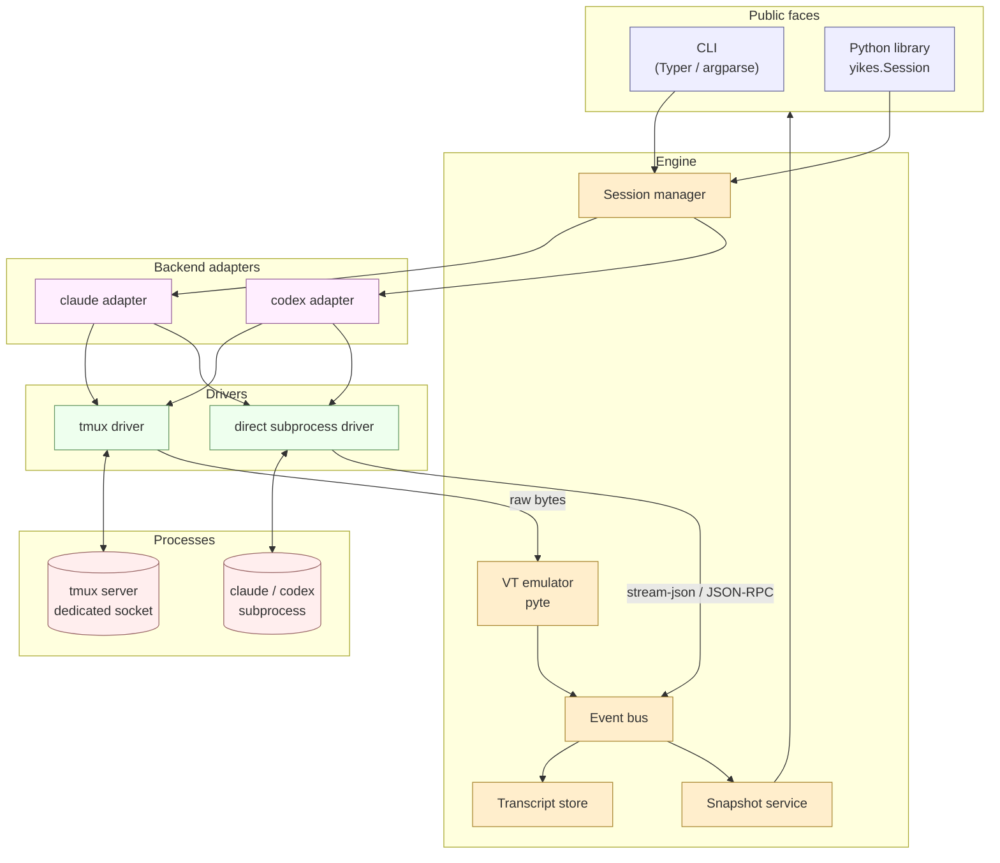
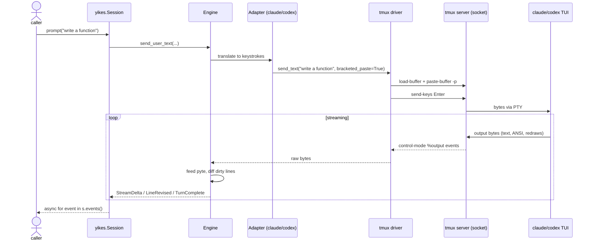
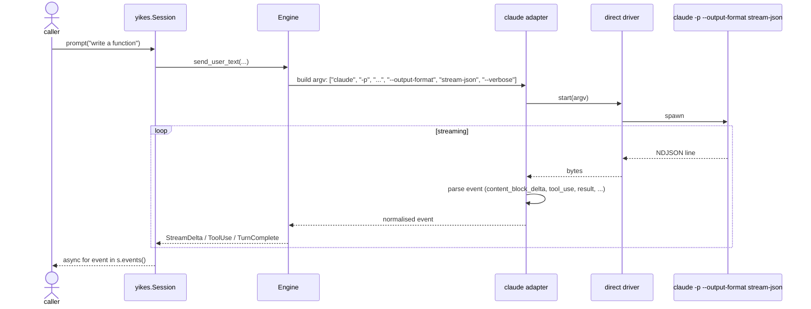
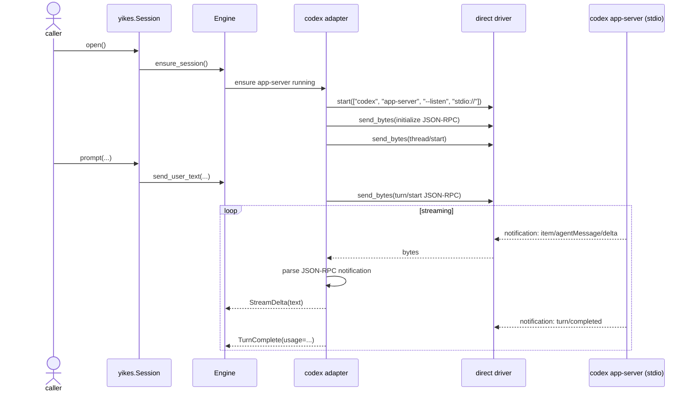
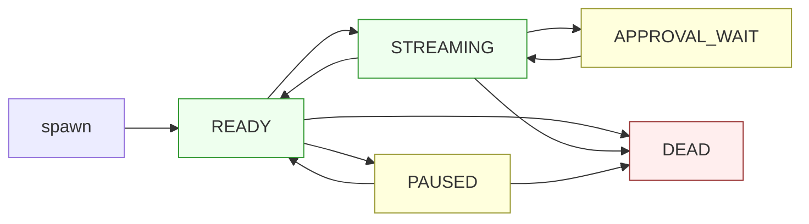
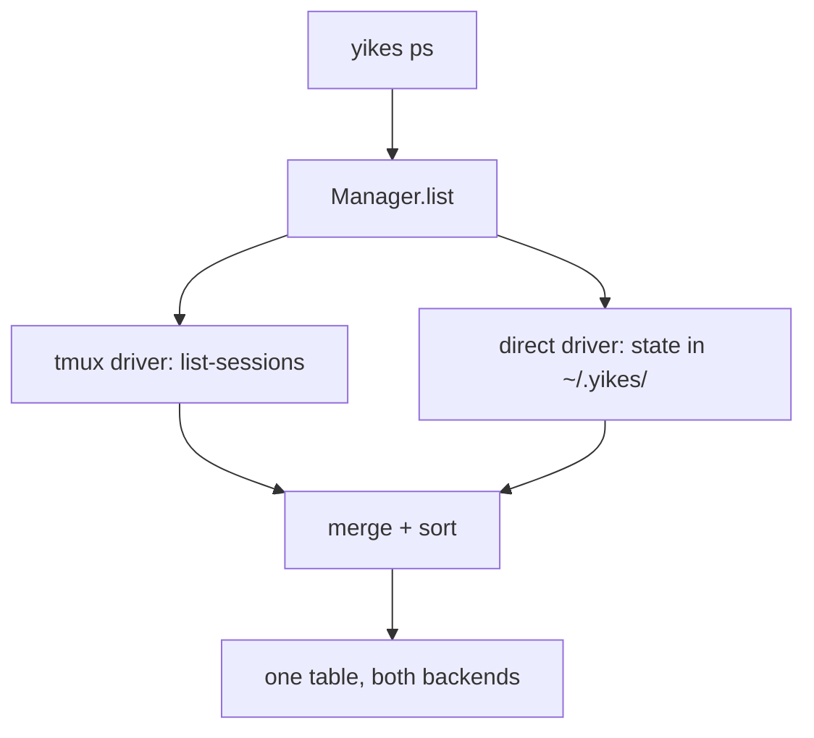

# Architecture

A layered design where the **engine** owns abstractions and policy, and a small set of pluggable **drivers** and **backend adapters** owns the protocol details.

## Big picture



## Layers

### 1. Public faces (`yikes.cli`, `yikes`)

- **CLI** — Typer-based; mirrors `claude` and `codex` flag surfaces (see [CLI Wrapper](cli-wrapper.md)).
- **Library** — `yikes.Session(...)` and friends (see [Python Library](python-library.md)).
- Neither face talks to subprocesses directly. They only invoke the engine.

### 2. Engine (`yikes.engine`)

Owns the **abstractions** that don't depend on which CLI or driver is in play.

- **Session manager** — creates, resumes, kills sessions; resolves session IDs to running adapters.
- **Event bus** — typed pub/sub; subscribers attach `async for` consumers.
- **Transcript store** — append-only JSONL per session under `~/.yikes/sessions/<id>.jsonl` for replay/inspection. Mirrors the structure of the CLIs' native transcripts but normalises across backends.
- **Snapshot service** — returns the rendered screen state for a session at any point. Cheap call; backed by either the VT emulator's grid (tmux driver) or the assembled message buffer (direct driver).
- **VT emulator (pyte)** — only used when the driver is `tmux`. Consumes raw bytes from `pipe-pane`, exposes a dirty-line set we diff into `LineRevised` events.

### 3. Backend adapters (`yikes.backends.claude`, `yikes.backends.codex`)

Each adapter knows:

- How its CLI is invoked (binary name, flag mapping).
- The native event schema (`stream-json` for Claude, `app-server` JSON-RPC and `exec --json` for Codex).
- How to translate adapter-specific events to the engine's normalised events.
- Which TUI keystrokes correspond to which actions (approve, cancel, slash command, paste).

The adapter is **driver-agnostic** — it delegates I/O to the driver and just speaks its own protocol on top.

### 4. Drivers (`yikes.drivers.tmux`, `yikes.drivers.direct`)

Two implementations of the same internal interface:

```python
class Driver(Protocol):
    async def start(self, argv: list[str], env: dict[str, str], cwd: Path) -> None: ...
    async def send_text(self, text: str, *, bracketed_paste: bool = False) -> None: ...
    async def send_key(self, key: str) -> None: ...     # "Enter", "C-c", "y", ...
    async def send_bytes(self, b: bytes) -> None: ...   # raw, e.g. for JSON-RPC frames
    def stream(self) -> AsyncIterator[bytes]: ...       # raw output bytes
    async def snapshot(self) -> str: ...                 # current rendered screen / buffer
    async def resize(self, cols: int, rows: int) -> None: ...
    async def stop(self) -> None: ...
```

The **tmux driver** implements this against a managed tmux server on a dedicated socket. The **direct driver** implements it against a plain PTY subprocess. The engine never sees the difference.

For the `direct` driver, `send_key` is mostly a no-op for `claude -p` (one-shot, doesn't accept input mid-run) but is real for `codex app-server` (where you can send JSON-RPC `turn/cancel`, etc.).

## Data flow — `tmux` driver



## Data flow — `direct` driver, Claude headless



## Data flow — `direct` driver, Codex app-server



## The event model

All events are dataclasses defined in `yikes.events`. They're the same regardless of backend or driver — the adapter does the translation.

```python
@dataclass(frozen=True)
class Event:
    session_id: str
    seq: int                  # monotonic per session
    ts: float                 # epoch seconds

@dataclass(frozen=True)
class StreamDelta(Event):
    """A streamed text chunk from the assistant."""
    text: str
    block_id: str             # stable across deltas of the same block
    role: Role = Role.ASSISTANT

@dataclass(frozen=True)
class LineRevised(Event):
    """A previously-rendered line was overwritten (TUI redraw)."""
    line_no: int              # row in the rendered grid
    new_text: str
    prev_text: str | None

@dataclass(frozen=True)
class ToolUse(Event):
    tool: str                 # "Bash", "Edit", "Read", "WebFetch", ...
    input: dict
    tool_use_id: str

@dataclass(frozen=True)
class ToolResult(Event):
    tool_use_id: str
    output: str
    is_error: bool

@dataclass(frozen=True)
class ApprovalRequest(Event):
    """The TUI is prompting for permission. Caller must call session.approve() or session.deny()."""
    prompt: str
    options: list[str]        # ["yes", "no", "yes-and-don't-ask-again"]
    request_id: str

@dataclass(frozen=True)
class TurnComplete(Event):
    stop_reason: str
    usage: Usage | None       # tokens, cost; None when unavailable (TUI mode)
```

See [Streaming & Updates](streaming.md) for how `StreamDelta` vs `LineRevised` get emitted and how a caller can choose to consume either or both.

## Concurrency model

Python 3.14 asyncio with `TaskGroup`:

```python
async with asyncio.TaskGroup() as tg:
    tg.create_task(driver_reader())     # pipe-pane / stdout drain
    tg.create_task(emulator_pump())     # feed pyte, emit events
    tg.create_task(notification_pump()) # tmux control-mode notifications
    tg.create_task(transcript_writer()) # append events to JSONL
```

Cancellation propagates structurally. A single `asyncio.timeout` wraps "wait for prompt to appear" sentinel checks.

## Session lifecycle — uniform across backends

A first-class design requirement: **the user picks provider (Claude/Codex) and mode (interactive/streaming/headless); everything else is automated.** That includes the verbs that manage a session's lifetime — and they look identical for both backends.



The verbs:

| Verb | Library | CLI | What it does |
|---|---|---|---|
| **spawn** | `Manager.spawn(backend=...)` | `yikes spawn [-b claude\|codex]` | Create a new session. Returns ID. |
| **list** | `Manager.list()` | `yikes ps` | All live sessions, both backends, in one table. |
| **get** | `Manager.get(id_or_name)` | implicit via `-s <id>` | Look up an existing session. |
| **attach** | (CLI-only) | `yikes attach <id>` | Drop the user into the TUI in their terminal. |
| **kill** | `Manager.kill(id)` | `yikes kill <id>` | Terminate one session. |
| **kill_all** | `Manager.kill_all()` | `yikes killall` | Terminate every session on our socket. |
| **resume** | `Manager.spawn(..., resume=<native-id>)` | `yikes spawn --resume <id>` | Pick up a saved native session. |

The point: **the user's mental model is `yikes`, not `tmux`.** They never need to know which tmux socket we use, what the pane ID is, or that Claude Code and Codex have different native session-ID formats. `yikes ps` shows both, in the same columns, with the same lifecycle states.



Internally:

- **tmux driver** maintains pane-tagged metadata (`YIKES_BACKEND`, `YIKES_NATIVE_ID`, `YIKES_MODEL`) per session, queried via `tmux list-sessions -F '...'`.
- **direct driver** (long-lived `codex app-server`) tracks its sessions in `~/.yikes/state/`.
- The Manager unions both and returns a single sorted list.

This is what makes "for the user it shall not make a major difference" real: they pick a backend and a mode, and the session ops above behave the same way regardless.

## Persistence and the user's session files

We do not replace either CLI's native session storage:

- Claude Code keeps transcripts at `~/.claude/projects/<project>/<session-id>.jsonl`.
- Codex keeps rollouts at `~/.codex/sessions/YYYY/MM/DD/rollout-*.jsonl(.zst)`.

We **co-locate** our normalised view at `~/.yikes/sessions/<our-id>.jsonl`, with a sidecar JSON that records the native session ID so we can pass `--resume`/`codex resume` through cleanly. Users get both: the CLI's native record for use with `claude --resume <id>`, and ours for replay through the library.

## Open architectural questions

These need user input before implementation; they're tracked in [Roadmap](roadmap.md#open-questions).

1. **Codex `app-server` framing** — newline-delimited JSON without the `"jsonrpc":"2.0"` header on the wire. We should generate types via `codex app-server generate-ts` and check the schema in, rather than hand-rolling.
2. **Driver auto-selection** — should the engine pick `tmux` vs `direct` automatically based on the operation, or require explicit user choice? Recommendation: heuristic default, explicit override always wins.
3. **Cross-backend `Session` lifetime** — Claude Code's native resume vs Codex's `thread/resume` — do we map them to one `Session.resume(id)`? Recommendation: yes, with a per-backend ID format and a thin adapter.
4. **Approval handling defaults** — auto-approve `Read`-only tools? Or always defer to the caller? Recommendation: defer; offer a policy hook.
