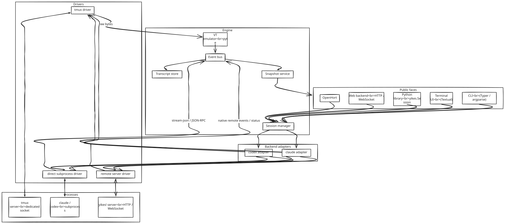
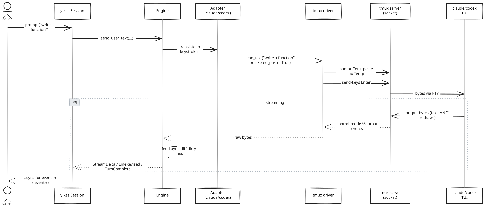
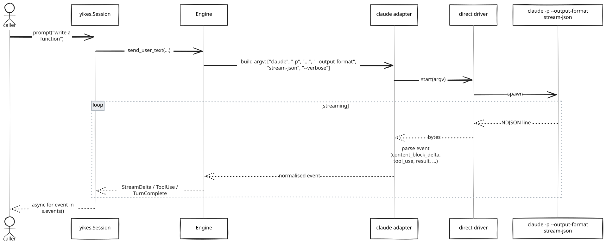
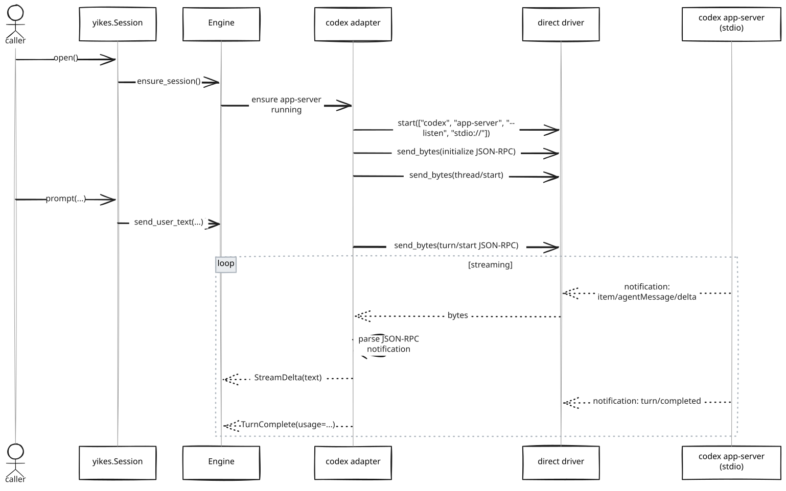
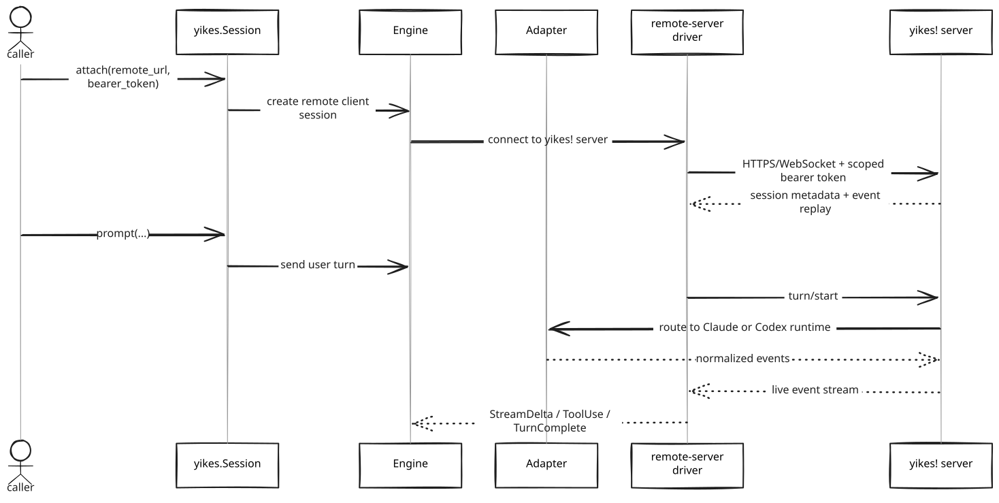
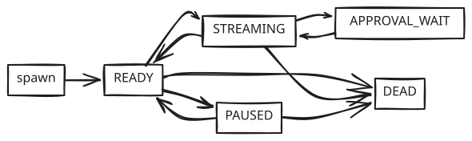
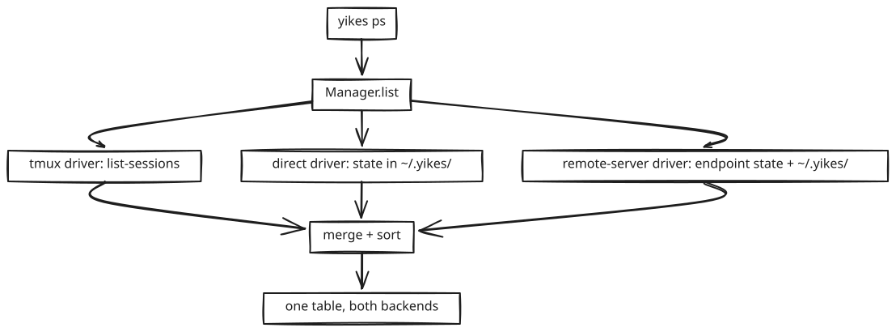

# Architecture

A layered design where the **engine/session manager** owns durable state and policy, and a small set of pluggable **runtime drivers** and **backend adapters** owns the protocol details. The terminal UI, CLI, Python library, web backend, and OpenHort are clients of the same manager.

## Big picture

<p align="center"></p>

## Layers

### 1. Public faces (`yikes.cli`, `yikes`)

- **CLI** — Typer-based; mirrors `claude` and `codex` flag surfaces (see [CLI Wrapper](cli-wrapper.md)).
- **Library** — `ChatService.create_session(...)` today, later `yikes.Manager` and durable `yikes.Session` (see [Python Library](python-library.md)).
- **Web/OpenHort clients** — attach to the same manager. They do not own Claude/Codex processes directly.
- Neither face talks to subprocesses directly. They only invoke the engine.

### 2. Engine (`yikes.engine`)

Owns the **abstractions** that don't depend on which CLI or driver is in play.

- **Session manager** — creates, resumes, lists, attaches, kills, and destroys sessions; resolves session IDs to running adapters and runtimes. This manager is the durable owner. Frontends can disconnect without killing backend work.
- **Event bus** — typed pub/sub; subscribers attach `async for` consumers.
- **Transcript store** — append-only JSONL per session under `~/.yikes/sessions/<id>.jsonl` for replay/inspection. Mirrors the structure of the CLIs' native transcripts but normalises across backends.
- **Snapshot service** — returns the rendered screen state for a session at any point. Cheap call; backed by the VT emulator's grid (tmux driver), the assembled message buffer (direct driver), or the backend's remote session state when available.
- **VT emulator (pyte)** — only used when the driver is `tmux`. Consumes raw bytes from tmux control-mode `%output`, exposes a dirty-line set we diff into `LineRevised` events.

### 3. Backend adapters (`yikes.backends.claude`, `yikes.backends.codex`)

Each adapter knows:

- How its CLI is invoked (binary name, flag mapping).
- The native event schema (`stream-json` for Claude, `app-server` JSON-RPC and `exec --json` for Codex).
- How to translate adapter-specific events to the engine's normalised events.
- Which TUI keystrokes correspond to which actions (approve, cancel, slash command, paste).

The adapter is **driver-agnostic** — it delegates I/O to the driver and just speaks its own protocol on top.

### 4. Runtime drivers (`yikes.drivers.direct`, `yikes.drivers.tmux`, future `yikes.drivers.remote_server`)

Three implementations of the same internal interface:

```python
class Driver(Protocol):
    async def start(self, argv: list[str], env: dict[str, str], cwd: Path) -> None: ...
    async def send_text(self, text: str, *, bracketed_paste: bool = False) -> None: ...
    async def send_key(self, key: str) -> None: ...     # "Enter", "C-c", "y", ...
    async def send_bytes(self, b: bytes) -> None: ...   # raw, e.g. for JSON-RPC frames
    def stream(self) -> AsyncIterator[bytes]: ...       # raw output bytes
    async def snapshot(self) -> str: ...                 # current rendered screen / buffer
    async def resize(self, cols: int, rows: int) -> None: ...
    async def stop(self) -> None: ...
```

The **direct driver** implements this against a plain subprocess or PTY. The **tmux driver** implements it against a managed tmux server on a dedicated socket. The **docker driver** implements it against a managed Docker sandbox. The **remote-server driver** implements it against a yikes!-owned HTTP/WebSocket control plane with scoped bearer-token auth.

For the `direct` driver, `send_key` is mostly a no-op for `claude -p` (one-shot, doesn't accept input mid-run) but is real for `codex app-server` (where cancellation is a JSON-RPC `turn/interrupt`). For remote access, yikes! should not depend on Claude Remote Control as a chat transport; remote clients attach to a yikes! server session.

## Mode matrix

The six local/isolation combinations are first-class integration test targets. Remote-server is tested as the authenticated attach/control-plane runtime:

| Backend | `direct` | `tmux` | `docker` | `remote-server` |
|---|---|---|---|---|
| Claude Code | `claude -p --output-format stream-json`, plus bidirectional stream-json where supported | `claude` in a managed tmux pane | `claude` inside a managed Docker sandbox with host MCP proxy URLs | yikes! server owns a Claude session and exposes yikes! events over HTTP/WebSocket |
| Codex CLI | `codex app-server --listen stdio://` by default, `codex exec --json` for one-shot | `codex --no-alt-screen` in a managed tmux pane | `codex` inside a managed Docker sandbox with host MCP proxy URLs | yikes! server owns Codex app-server/thread state and exposes yikes! events over HTTP/WebSocket |

The current code still has a `remote-control` enum value as an integration-test placeholder and compatibility slot. It is intentionally not available in the interactive chat registry. The target runtime name for OpenHort integration is `remote-server`.

## Data flow — `tmux` driver

<p align="center"></p>

## Data flow — `direct` driver, Claude headless

<p align="center"></p>

## Data flow — `direct` driver, Codex app-server

<p align="center"></p>

## Data flow — remote server attach

<p align="center"></p>

Remote server attach is not tmux over SSH and not Claude Remote Control. It is a yikes!-owned control plane. The remote host runs yikes!, owns the backend process and policy, and clients attach through authenticated HTTP/WebSocket APIs.

## The event model

All events are dataclasses defined in `yikes.events`. They're the same regardless of backend or driver — the adapter does the translation.

```python
@dataclass(frozen=True)
class Event:
    session_id: str
    seq: int                  # monotonic per session
    ts: float                 # epoch seconds

@dataclass(frozen=True)
class StreamDelta(Event):
    """A streamed text chunk from the assistant."""
    text: str
    block_id: str             # stable across deltas of the same block
    role: Role = Role.ASSISTANT

@dataclass(frozen=True)
class LineRevised(Event):
    """A previously-rendered line was overwritten (TUI redraw)."""
    line_no: int              # row in the rendered grid
    new_text: str
    prev_text: str | None

@dataclass(frozen=True)
class ToolUse(Event):
    tool: str                 # "Bash", "Edit", "Read", "WebFetch", ...
    input: dict
    tool_use_id: str

@dataclass(frozen=True)
class ToolResult(Event):
    tool_use_id: str
    output: str
    is_error: bool

@dataclass(frozen=True)
class ApprovalRequest(Event):
    """A backend asks for permission. Caller must answer this exact request."""
    prompt: str
    options: list[str]        # ["yes", "no", "yes-and-don't-ask-again"]
    request_id: str
    backend_request_id: str | None
    thread_id: str | None
    turn_id: str | None
    item_id: str | None

@dataclass(frozen=True)
class TurnComplete(Event):
    stop_reason: str
    usage: Usage | None       # tokens, cost; None when unavailable (TUI mode)
```

See [Streaming & Updates](streaming.md) for how `StreamDelta` vs `LineRevised` get emitted and how a caller can choose to consume either or both.

## Command registry and suggestions

Slash commands are a shared capability, not a terminal-only feature. The canonical command surface lives in a `CommandRegistry` that exposes:

- command metadata: name, usage, aliases, and description
- execution: the same handler path for TUI, CLI, and future web calls
- suggestions: prefix completion for commands and argument completion for command-specific values
- preview hints: commands such as `/models` can show contextual options before Enter is pressed

Model names and other contextual arguments come from provider registries. The UI must not hardcode `/model`, `/models`, `/backend`, `/location`, `/driver`, `/web`, `/dirs`, or `/mcp` choices; it asks registries for valid options for the active backend, location, and driver. As backend adapters mature, those providers should prefer live capability discovery or backend-reported metadata, with static defaults used only as a fallback.

The intended behavior is broader than model selection: every slash command that accepts constrained arguments should register its own suggestion provider. This lets the Textual app autocomplete commands today and lets a web backend later return the same suggestions over HTTP or websocket.

## Persisted app state

The terminal app persists the user's last interactive choices in a small JSON state file:

- backend
- connection mode / driver
- model
- complexity level
- web search enabled/disabled
- readable directories
- writable directories
- attached MCP servers

The default path is `~/.config/yikes/state.json`, with `YIKES_STATE_PATH` available for tests and isolated runs. This state is part of the app shell, not the transcript: restarting yikes restores how the user wants to connect and reason, but it does not silently restore previous chat messages.

Interactive chat drivers are intentionally limited to transports that can service a prompt/response turn. Claude Remote Control remains excluded from the interactive registry because it is a human remote UI, not a yikes! programmatic transport. The remote target for OpenHort is a yikes! server session.

## Concurrency model

Python 3.14 asyncio with `TaskGroup`:

```python
async with asyncio.TaskGroup() as tg:
    tg.create_task(driver_reader())     # direct stdout, tmux %output, or remote events
    tg.create_task(emulator_pump())     # feed pyte, emit events
    tg.create_task(notification_pump()) # backend/tmux status notifications
    tg.create_task(transcript_writer()) # append events to JSONL
```

Cancellation propagates structurally. A single `asyncio.timeout` wraps "wait for prompt to appear" sentinel checks.

## Session lifecycle — uniform across backends

A first-class design requirement: **the user picks provider (Claude/Codex) and mode (interactive/streaming/headless); everything else is automated.** That includes the verbs that manage a session's lifetime — and they look identical for both backends.

<p align="center"></p>

The verbs:

| Verb | Library | CLI | What it does |
|---|---|---|---|
| **spawn** | `Manager.spawn(backend=...)` | `yikes spawn [-b claude\|codex]` | Create a new session. Returns ID. |
| **list** | `Manager.list()` | `yikes ps` | All live sessions, both backends, in one table. |
| **get** | `Manager.get(id_or_name)` | implicit via `-s <id>` | Look up an existing session. |
| **attach** | (CLI-only) | `yikes attach <id>` | Drop the user into the TUI in their terminal. |
| **kill** | `Manager.kill(id)` | `yikes kill <id>` | Terminate one session. |
| **kill_all** | `Manager.kill_all()` | `yikes killall` | Terminate every session on our socket. |
| **resume** | `Manager.spawn(..., resume=<native-id>)` | `yikes spawn --resume <id>` | Pick up a saved native session. |

The point: **the user's mental model is `yikes`, not `tmux`.** They never need to know which tmux socket we use, what the pane ID is, or that Claude Code and Codex have different native session-ID formats. `yikes ps` shows both, in the same columns, with the same lifecycle states.

The terminal UI follows the same model: session navigation is shown as tabs at the top of the app, and the sidebar stays limited to compact status plus session actions. Backend, location, driver, model, complexity, web, MCP, and directory policy changes go through the shared slash-command registry so the Textual UI, Python library, and future web client all ask the same source for valid commands and completions.

<p align="center"></p>

Internally:

- **tmux driver** maintains pane-tagged metadata (`YIKES_BACKEND`, `YIKES_NATIVE_ID`, `YIKES_MODEL`) per session, queried via `tmux list-sessions -F '...'`.
- **direct driver** (long-lived `codex app-server`) tracks its sessions in `~/.yikes/state/`.
- **docker driver** stores sandbox/container metadata and should communicate with an in-container yikes! worker server after bootstrap. Docker and remote machines therefore share the same authenticated WebSocket protocol; local `docker exec` is kept for bootstrap, attach, and debug rather than normal prompt transport.
- **remote-server driver** stores endpoint metadata (`remote_url`, environment/session labels, websocket endpoint, auth mode) in `~/.yikes/state/`, but never stores bearer tokens in transcripts.
- The Manager unions all runtime sources and returns a single sorted list.

This is what makes "for the user it shall not make a major difference" real: they pick a backend and a mode, and the session ops above behave the same way regardless.

## Persistence and the user's session files

We do not replace either CLI's native session storage:

- Claude Code keeps transcripts at `~/.claude/projects/<project>/<session-id>.jsonl`.
- Codex keeps rollouts at `~/.codex/sessions/YYYY/MM/DD/rollout-*.jsonl(.zst)`.

We **co-locate** our normalised view at `~/.yikes/sessions/<our-id>.jsonl`, with a sidecar JSON that records the native session ID so we can pass `--resume`/`codex resume` through cleanly. Users get both: the CLI's native record for use with `claude --resume <id>`, and ours for replay through the library.

## Open architectural questions

These need user input before implementation; they're tracked in [Roadmap](roadmap.md#open-questions).

1. **Codex `app-server` framing** — newline-delimited JSON without the `"jsonrpc":"2.0"` header on the wire. We should generate types via `codex app-server generate-ts` and check the schema in, rather than hand-rolling.
2. **Runtime auto-selection** — should the engine pick `direct`, `tmux`, `docker`, or `remote-server` automatically based on the operation, or require explicit user choice? Recommendation: `direct` for one-shot structured work, `tmux` for local TUI/human attach, `docker` for isolated work, `remote-server` only when explicitly requested or when connecting to a configured server.
3. **Cross-backend `Session` lifetime** — Claude Code's native resume vs Codex's `thread/resume` — do we map them to one `Session.resume(id)`? Recommendation: yes, with a per-backend ID format and a thin adapter.
4. **Approval handling defaults** — auto-approve `Read`-only tools? Or always defer to the caller? Recommendation: defer; offer a policy hook.
