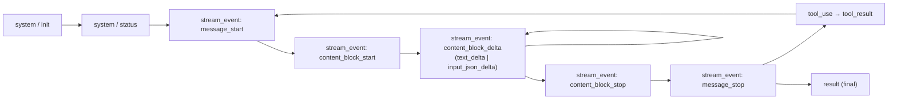
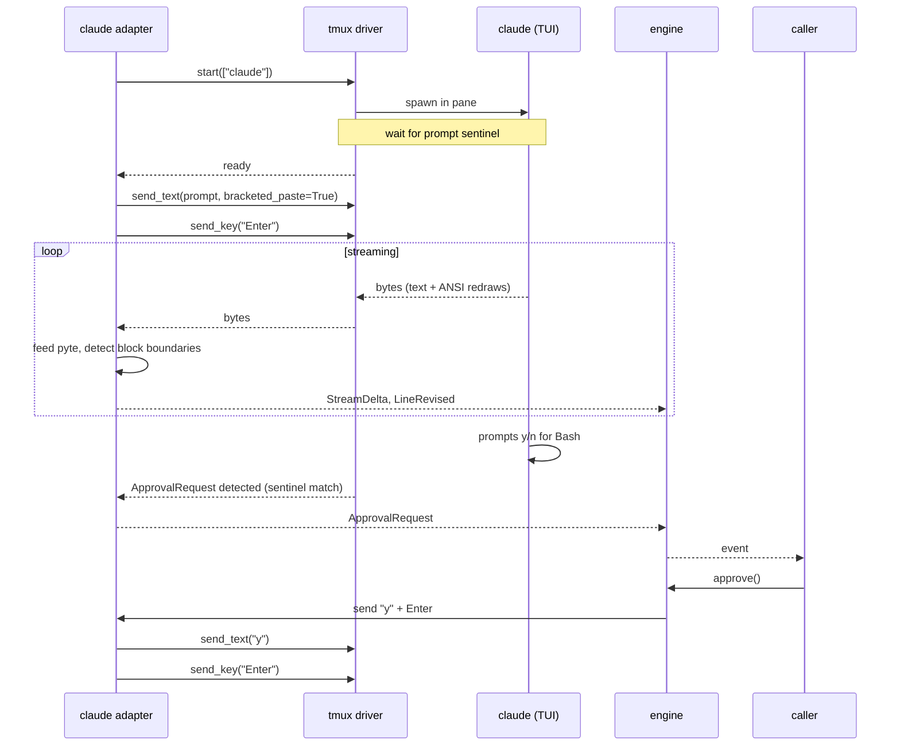

# Backend: Claude Code

The Claude Code adapter (`yikes.backends.claude`) drives the `claude` CLI in three modes:

- **TUI mode** — `claude` (REPL) inside a tmux pane. Keystrokes for everything.
- **Headless mode** — `claude -p ... --output-format stream-json --verbose`. Parsed NDJSON straight into the event bus.
- **Remote-control mode** — `claude --remote-control [name]` or `/remote-control`, where the local process is controlled through claude.ai / the Claude app.

## I/O reference (summary)

Full reference is in the research notes; here's what the adapter actually uses.

### Input

| Need | Mechanism |
|---|---|
| One-shot prompt | `claude -p "..."` |
| Multi-turn (resume) | `claude --resume <session-id>` |
| Continue most-recent | `claude --continue` |
| Streaming input/output | `--input-format stream-json --output-format stream-json` |
| Remote Control | `--remote-control [name]` / `--rc [name]`, or `/remote-control` inside an interactive session |
| File reference in prompt | `@path/to/file` (glob OK) |
| System prompt | `--system-prompt`, `--append-system-prompt` (and `*-file` variants) |
| Settings override | `--settings '{...}'` or `--settings ./file.json` |
| Tool gating | `--allowedTools "Bash(git *),Read"`, `--disallowedTools "WebFetch"` |
| Permission mode | `--permission-mode auto\|acceptEdits\|plan\|default\|dontAsk\|bypassPermissions` |
| Run-cost limits | `--max-turns N`, `--max-budget-usd 5.00` |
| Skip auto-discovery | `--bare` |
| Structured output | `--output-format json --json-schema '<JSON Schema>'` |
| Disable session save | `--no-session-persistence` |

### Output (stream-json)

NDJSON. Event types we consume:



Key fields:

```json
{ "type": "stream_event",
  "event": { "type": "content_block_delta", "index": 0,
             "delta": { "type": "text_delta", "text": "Hello" } },
  "session_id": "..." }
```

The adapter maps:

| Native event | Engine event |
|---|---|
| `content_block_delta` (text_delta) | `StreamDelta(text=..., block_id=index)` |
| `content_block_delta` (input_json_delta) | accumulated to `ToolUse` at `content_block_stop` |
| `tool_use` | `ToolUse(tool=..., input=..., tool_use_id=...)` |
| `tool_result` | `ToolResult(...)` |
| `permission_request` | `ApprovalRequest(...)` |
| `result` (final) | `TurnComplete(stop_reason, usage)` |

### Exit codes & session storage

- Exit 0 success; 1 runtime error; 2 invalid args.
- Transcripts: `~/.claude/projects/<project-id>/<session-id>.jsonl`. We record the session ID in our sidecar so `--resume` works.

## Driving Claude Code in **tmux mode**



### Keystroke vocabulary

The adapter exposes a verb table that the tmux driver applies:

| Verb | tmux send-keys |
|---|---|
| send prompt | `load-buffer` → `paste-buffer -p -d` → `Enter` |
| submit | `Enter` |
| newline in prompt | `Shift+Enter` or `Alt+Enter` depending on terminal |
| cancel turn | `C-c` (one press) |
| exit | `C-d` (twice — first cancels, second exits) |
| approve | `y` then `Enter` |
| deny | `n` then `Enter` |
| slash command | literal `/<name> args` + `Enter` |
| paste image | path via `@path/to/img.png` in prompt, or stdin paste |
| switch model | `/model` slash command |
| compact context | `/compact` slash command |

### Detecting approval prompts

Claude Code surfaces approval prompts with a recognisable layout: a box with "Do you want to" text and option lines (`1. Yes`, `2. No, and tell Claude what to do differently`). The adapter watches `LineRevised` events in the bottom rows and triggers an `ApprovalRequest` when a known-shape modal appears.

A safer fallback is to **run with `--permission-mode acceptEdits` or `dontAsk`** when we *don't* want approval flows, which removes the modal entirely.

## Driving Claude Code in **direct (headless) mode**

```python
argv = [
    "claude", "-p", prompt,
    "--output-format", "stream-json",
    "--include-partial-messages",
    "--verbose",
    *resume_args,
    *system_prompt_args,
    *tool_args,
]
```

The adapter consumes NDJSON line by line and emits events. No tmux, no pyte. ~3–10 ms latency floor over a direct PTY (no measurable overhead).

For a streaming **bidirectional** session in headless mode, use `--input-format stream-json --output-format stream-json` and write user messages as JSON to stdin:

```json
{"type":"user_message","content":"hello"}
{"type":"user_message","content":"now please refactor"}
```

This is the closest direct-mode analogue to a long-lived TUI session, but mid-turn slash commands and approval flows are not available — for those, switch to `tmux` mode.

## Driving Claude Code in **remote-control mode**

```bash
claude --remote-control "My Project"
```

The local `claude` process stays running and makes outbound TLS connections to Anthropic. Remote users connect through `claude.ai/code` or the Claude mobile app; yikes records the remote session metadata and emits lifecycle/status events.

Remote-control mode is a native remote-human workflow, not a terminal byte stream:

- No inbound port is opened by yikes.
- One normal interactive `claude` process maps to one remote-control session.
- If the local process exits, sleeps, or loses network long enough for Claude Code to time out, the remote session ends.
- Some local-only slash commands and terminal pickers are not available remotely.
- We do not infer approvals by sending raw `y` keystrokes in this mode; approvals are handled by Claude's remote UI.

For automated structured output, use `direct`. For local TUI attach or local prompt automation, use `tmux`. For remote/mobile continuation by a human through Claude's own remote UI, use Claude remote-control lifecycle commands. Do not model Claude remote-control as a yikes chat transport unless Claude exposes a documented programmatic turn API.

## Adapter responsibilities

```python
class ClaudeAdapter(BackendAdapter):
    backend = "claude"

    async def start_direct_session(self, opts: SessionOptions) -> None:
        # build argv, spawn via direct driver, parse stream-json
        ...

    async def start_tmux_session(self, opts: SessionOptions) -> None:
        # start "claude" or "claude --resume <id>" in a tmux pane,
        # wait for prompt sentinel, register keystroke vocabulary
        ...

    async def start_remote_control_session(self, opts: SessionOptions) -> None:
        # start "claude --remote-control [name]" and parse remote URL/status
        ...

    def parse(self, raw: bytes) -> Iterator[Event]:
        # direct mode: NDJSON → events
        # tmux mode: pyte dirty-line diff → events + approval-prompt detection
        # remote-control mode: lifecycle/status metadata from the native remote surface
        ...
```

## Version pinning and auto-update

Claude Code **auto-updates by default**. It checks periodically and installs new releases silently in the background. For a library that parses `stream-json` event shapes and recognises TUI modal layouts, an overnight update can break our test fixtures and approval-prompt detection without warning.

!!! warning "Disable auto-update for sessions yikes manages"
    Set `DISABLE_AUTOUPDATER=1` in the environment we pass to every spawned `claude` process. This neutralises the updater for the lifetime of our sessions without forcing a global change on the user's machine.

What the adapter does:

1. **Per-process kill switch.** When the engine spawns `claude`, it injects `DISABLE_AUTOUPDATER=1` into the child env. The user's interactive `claude` outside our wrapper still auto-updates normally.
2. **Version probe on spawn.** Run `claude --version` once, record the result. If it's newer than the highest schema/fixture version we ship, emit a `Notice(level=warning, message="claude version X is newer than the version yikes was tested against (Y); event parsing may be incomplete")`.
3. **Schema snapshots in repo.** A directory `tests/fixtures/claude/<version>/` stores recorded `stream-json` byte streams. CI replays them against the parser. When we want to support a new version, we record fresh fixtures and bump the supported range.
4. **Pin in CI.** Our own CI installs an exact version: `npm install -g @anthropic-ai/claude-code@<pinned>`. Production users get whatever they have; we just refuse to silently misbehave on a version we haven't tested.

If a user wants to disable auto-update globally (recommended for anyone running long-lived `yikes` sessions), they can also set in `~/.claude/settings.json`:

```json
{ "autoUpdates": false }
```

…but this is **their choice**, not something we change for them.

Manual updates: `claude update` (and `/doctor` to inspect the installation).

## Known gotchas

- **`stream-json` requires `--verbose`.** Otherwise you get a single `result` event with no deltas.
- **`stream-json` requires `--include-partial-messages`** for fine-grained `content_block_delta` events; otherwise messages arrive in one chunk.
- **`--bare` skips CLAUDE.md, hooks, plugins, MCP.** Use it for deterministic CI; *don't* use it for the tmux mode where the user likely wants their config.
- **Multi-line paste via tmux can collapse to one line** if the user has `extended-keys-format csi-u`. The tmux layer runs on a dedicated socket with that off — see [tmux Layer](../tmux-layer.md#isolation).
- **Approval-prompt detection is heuristic.** If Claude Code changes its modal rendering, our regex needs updating. Wrap detection in a versioned matcher with a fallback test fixture.
- **Remote Control is session-level.** It is useful for remote/mobile continuation, but it is not a replacement for `stream-json` when the caller needs machine-readable deltas.
