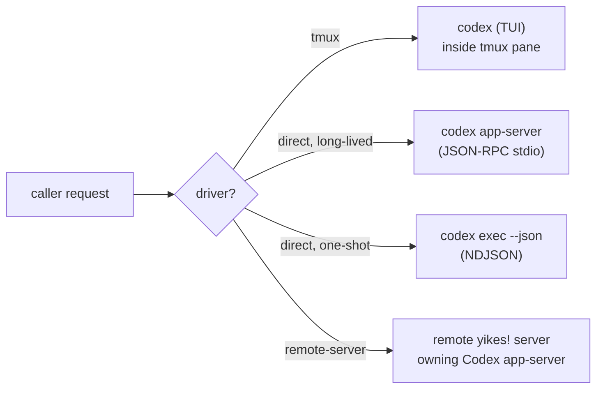
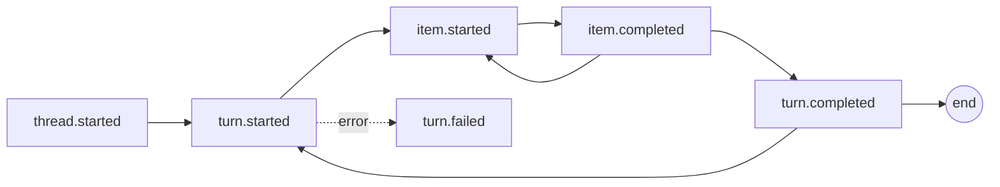
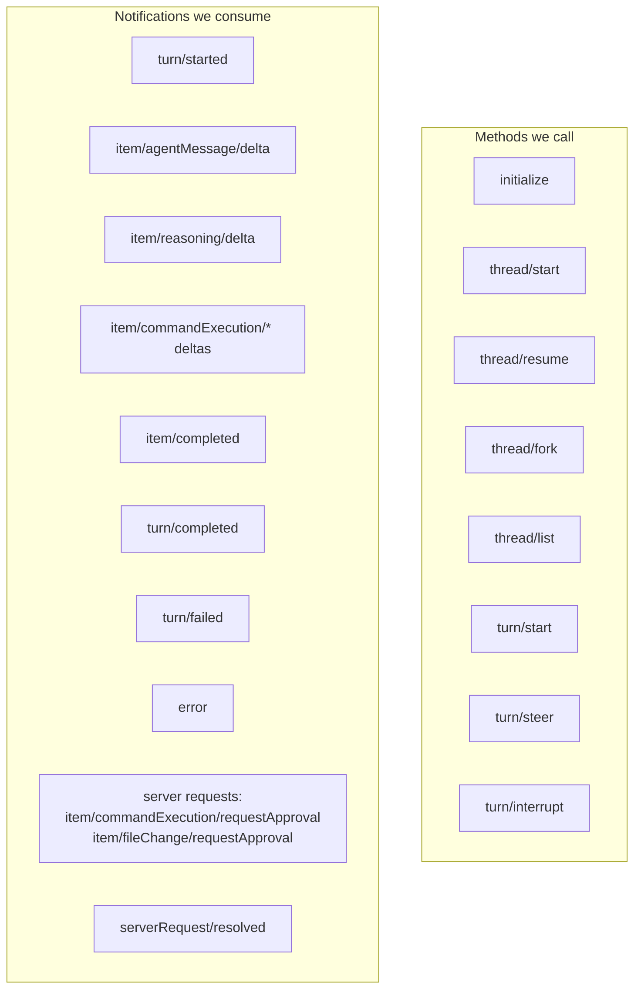
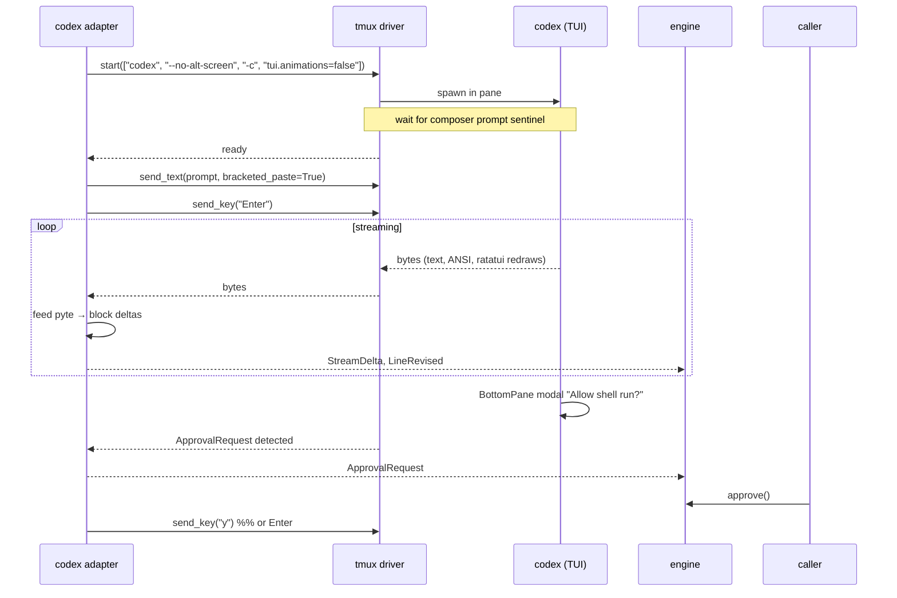

# Backend: Codex CLI

The Codex adapter (`yikes.backends.codex`) drives the `codex` binary. Codex has four useful entry points; the adapter picks based on driver and request:



**Default for `direct`** is `codex app-server` — it gives token-level deltas, supports turn cancellation, and is the canonical programmatic interface. `codex exec --json` is a fallback for genuinely single-shot scripted runs.

## I/O reference (summary)

### Invocation

| Need | Mechanism |
|---|---|
| Interactive TUI | `codex [PROMPT]` |
| Headless | `codex exec [PROMPT]` (alias `codex e`) |
| Resume | `codex resume --last` / `codex resume <SESSION_ID>` / `codex exec resume --last` |
| Fork | `codex fork` (interactive only — for the equivalent in `direct` mode, use `thread/fork` JSON-RPC) |
| Programmatic | `codex app-server --listen stdio://` |
| Remote app-server | useful inside the future yikes! remote-server runtime; non-loopback access requires yikes! auth/policy |
| Codex as MCP server | `codex mcp-server` (we don't use this for v1) |

### Input

| Need | Mechanism |
|---|---|
| Prompt | positional or stdin (`codex exec -`) |
| File reference | `@path` (fuzzy file picker in TUI; just literal in prompt elsewhere) |
| Shell preview | `!` prefix in composer (TUI only) |
| Image | `-i path.png` (repeatable) |
| Instructions | `AGENTS.md` (project + `~/.codex/AGENTS.md`) |
| Config | `~/.codex/config.toml`, `.codex/config.toml`, inline `-c key=value` |
| Sandbox | `--sandbox read-only\|workspace-write\|danger-full-access` |
| Approval | `--ask-for-approval untrusted\|on-request\|never` |
| Bypass everything | `--dangerously-bypass-approvals-and-sandbox` (alias `--yolo`) |
| Skip rollout persistence | `--ephemeral` |
| Skip git-repo check | `--skip-git-repo-check` |
| Structured output | `--output-schema schema.json` (+ `-o final.txt`) |

### Output

**`codex exec --json`** emits NDJSON. Top-level event types:



`item.completed.item.type` is one of `userMessage | agentMessage | reasoning | commandExecution | fileChange | mcpToolCall | webSearch | planUpdate`.

**`codex app-server`** speaks JSON-RPC 2.0 over stdio with newline-delimited frames (no `"jsonrpc":"2.0"` header on the wire). Methods and notifications:



Generate authoritative schemas:

```bash
codex app-server generate-ts             # TypeScript
codex app-server generate-json-schema    # JSON Schema bundle
```

We check these into the repo and codegen Python dataclasses from them at build time; we don't hand-roll the wire types.

### Native mapping to engine events

| Native | Engine event |
|---|---|
| `item/agentMessage/delta` | `StreamDelta(text, block_id=item_id, role=ASSISTANT)` |
| `item/reasoning/delta` | `StreamDelta(text, block_id=item_id, role=REASONING)` |
| `item.started`/`completed` with `commandExecution` | `ToolUse` + `ToolResult` |
| `item.completed` with `fileChange` | `ToolUse(tool="FileChange", input={diff})` |
| `item.completed` with `mcpToolCall` | `ToolUse(tool=f"mcp__{server}__{name}")` |
| `item/commandExecution/requestApproval`, `item/fileChange/requestApproval` | `ApprovalRequest` with `threadId`, `turnId`, `itemId`, and request id |
| `serverRequest/resolved` | clears pending `ApprovalRequest` |
| `turn/completed` | `TurnComplete(stop_reason, usage)` |
| `turn/failed`, `error` | `TurnFailed(reason)` |

### Exit codes & storage

- `0` success, `1` fatal (auth, missing MCP server, sandbox violation), `2` arg parse.
- Rollouts: `~/.codex/sessions/YYYY/MM/DD/rollout-*.jsonl(.zst)`.
- SQLite index: `~/.codex/state_5.sqlite`.
- Auth: `~/.codex/auth.json`. CI uses `CODEX_API_KEY`.

## Driving Codex in **tmux mode**



### Required tmux-mode flags

- `--no-alt-screen` — keep output in the primary screen so we get a clean grid for pyte. (Otherwise scrollback is lost on exit.)
- `-c tui.animations=false` — disable spinner animations; reduces noise in the byte stream.
- `--color never` if we don't want SGR sequences — but we *do* want them for the user-visible snapshot, so keep colours on and strip when needed.
- `--skip-git-repo-check` if we want to allow non-Git cwds.

### Keystroke vocabulary

| Verb | Keys |
|---|---|
| send prompt | bracketed paste + `Enter` |
| newline in composer | `Shift+Enter` or `Alt+Enter` |
| submit during running turn | `Enter` (steers) |
| queue follow-up | `Tab` while running |
| cancel turn | `Ctrl+C` |
| exit | `Ctrl+D` × 2 |
| clear screen | `Ctrl+L` (does not reset context) |
| reverse search | `Ctrl+R` |
| open external editor | `Ctrl+G` (`$VISUAL`/`$EDITOR`) |
| previous message edit | `Esc, Esc` (empty composer) |
| reasoning effort ± | `Alt+,` / `Alt+.` |
| fuzzy file picker | `@` |
| approval — accept | `y` or `Enter` |
| approval — deny | `n` or `Esc` |

### Slash commands the adapter knows

`/clear`, `/new`, `/resume`, `/fork`, `/compact`, `/copy`, `/model`, `/permissions`, `/diff`, `/review`, `/plan`, `/init`, `/status`, `/help`, `/exit`.

These work as literal-typed strings in the composer.

## Driving Codex in **direct mode (`app-server`)**

This is the preferred direct driver — it gives token-level streaming and full bidirectional control.

```python
argv = ["codex", "app-server", "--listen", "stdio://"]
```

Then over stdio:

```jsonc
// → request
{"id":0,"method":"initialize",
 "params":{"clientInfo":{"name":"yikes","version":"0.1.0"}}}

// ← response
{"id":0,"result":{"serverInfo":{"name":"codex","version":"0.130.x"},
                   "capabilities":{...}}}

// → notification
{"method":"initialized","params":{}}

// → start a thread (cwd, model, approval policy, sandbox)
{"id":1,"method":"thread/start",
 "params":{"model":"gpt-5.5","cwd":"/Users/x/proj",
           "approvalPolicy":"never","sandbox":"workspace-write"}}
// ← {"id":1,"result":{"thread":{"id":"thr_..."}}}

// → start a turn
{"id":2,"method":"turn/start",
 "params":{"threadId":"thr_...","input":[{"type":"text","text":"hello"}]}}

// ← notifications stream
{"method":"turn/started","params":{...}}
{"method":"item/started","params":{"itemId":"item_0","type":"agentMessage"}}
{"method":"item/agentMessage/delta","params":{"itemId":"item_0","delta":"Hello"}}
{"method":"item/agentMessage/delta","params":{"itemId":"item_0","delta":"!"}}
{"method":"item/completed","params":{"itemId":"item_0","type":"agentMessage"}}
{"method":"turn/completed","params":{"usage":{"input_tokens":...}}}
```

### Cancellation, approval, fork

| Operation | JSON-RPC |
|---|---|
| Cancel current turn | `turn/interrupt` with current `threadId` / active turn context |
| Steer current turn | `turn/steer` with current `threadId` and extra input |
| Respond to command approval | JSON-RPC response to `item/commandExecution/requestApproval` with `accept`, `acceptForSession`, `decline`, `cancel`, or an exec-policy amendment |
| Respond to file approval | JSON-RPC response to `item/fileChange/requestApproval` with `accept`, `acceptForSession`, `decline`, or `cancel` |
| Fork at a turn | `thread/fork` |
| Resume by ID | `thread/resume` |
| List sessions | `thread/list` (paginated; filter by `cwd`, dates) |

### Backpressure

Server returns JSON-RPC error code `-32001` "Server overloaded; retry later" when overloaded. The adapter retries with exponential backoff and jitter. WebSocket mode also has bounded outbound queues, so a future remote-server runtime must drain events promptly and reconnect/reconcile state if the transport drops.

### Capability negotiation

During `initialize`, set `capabilities.optOutNotificationMethods` to silence noisy event types (e.g. periodic status heartbeats).

## Codex Behind **remote-server**

Codex can expose app-server over WebSocket, but yikes! should put that behind its own remote-server auth and session API instead of exposing raw backend sockets as the public contract:

```bash
codex app-server --listen ws://127.0.0.1:4500
codex --remote ws://127.0.0.1:4500 --no-alt-screen
```

For programmatic yikes! control, the remote yikes! server owns the Codex app-server connection and emits normalized yikes! events. A client talks to yikes!, not directly to Codex.

Security defaults:

- Prefer loopback listeners and SSH port forwarding.
- If binding non-loopback, require explicit websocket auth (`--ws-auth capability-token --ws-token-file ...` or signed bearer token flags).
- Never put raw bearer tokens in process arguments, logs, or transcripts.
- Treat websocket transport as experimental until Codex marks it stable.

Remote path caveat: stock `codex --remote --cd <path>` has historically validated `--cd` on the client side. The yikes websocket client should send remote `cwd` in `thread/start` / `turn/start` instead of depending on local CLI validation, and should reject local-only image/path attachments unless it can copy them to the remote host.

## Driving Codex in **direct mode (`exec --json`)**

Used for genuinely one-shot scripted runs where we don't need cancellation or interactive features:

```python
argv = [
    "codex", "exec",
    "--json",
    "--sandbox", "workspace-write",
    "--ask-for-approval", "never",
    "--skip-git-repo-check",
    *system_args,
    prompt,
]
```

Parse NDJSON; emit engine events.

!!! warning "Known bug"
    `codex exec --json` + tools/MCP active has had correctness issues ([issue #15451](https://github.com/openai/codex/issues/15451)). Log raw bytes alongside parsed events while validating. For anything beyond trivial CI checks, prefer `app-server`.

## Authentication

| Source | Behaviour |
|---|---|
| `CODEX_API_KEY` env | Preferred for CI; overrides stored ChatGPT credentials. |
| `OPENAI_API_KEY` env | Accepted, deprioritised. |
| `~/.codex/auth.json` | ChatGPT-OAuth credentials from `codex login`. |
| `CODEX_HOME` env | Override `~/.codex` location (lets us point at a per-session config). |

The yikes engine forwards `CODEX_API_KEY` and lets `CODEX_HOME` be customised per session via `SessionOptions.env`.

## Version pinning and update behaviour

Codex has manual updates via `codex update`. Distribution method varies: the npm-published `@openai/codex` checks for new versions on launch and prompts; the Rust binary distributed via the repo doesn't auto-install but can still be auto-updated by package managers (`brew upgrade`, etc.). Either way, the JSON event schema has churned across releases (`item_type` → `type`, [issue #4776](https://github.com/openai/codex/issues/4776)) and our parser is sensitive to that.

The mitigation is the same as for Claude Code:

1. **Generated schema, checked in.** Run `codex app-server generate-json-schema` at build time and check the result into `_generated/`. Dataclasses are derived from this snapshot, not hand-rolled.
2. **Version probe on spawn.** Capture `codex --version`; warn if newer than tested.
3. **Pinned fixtures.** `tests/fixtures/codex/<version>/` with recorded `exec --json` and `app-server` byte streams.
4. **Pin in CI.** Install an exact version (`npm install -g @openai/codex@<pinned>` or fetch a specific GitHub release).
5. **Suppress the prompt-on-launch update nag** by passing `--no-update-check` if/when that flag stabilises (currently inconsistent across versions — verify in `codex --help` for the version you're targeting). If unavailable, dismiss programmatically by waiting for the prompt sentinel and ignoring the nag region.

We do **not** disable user-level auto-update for the codex binary itself — there's no equivalent of `DISABLE_AUTOUPDATER=1`. The defence is purely on our side (probe + fixtures + pinned CI).

## Known gotchas

- **`--full-auto` is deprecated.** Use explicit `--sandbox` + `--ask-for-approval`.
- **JSON event schema has churned** (`item_type` → `type`). We generate types from `codex app-server generate-json-schema` rather than hand-coding.
- **TUI uses alternate screen by default.** Pass `--no-alt-screen` in tmux mode.
- **AGENTS.md discovery order:** `AGENTS.override.md` → `AGENTS.md` → fallbacks, root-down concatenation. The adapter doesn't touch this; it's Codex's job.
- **Approval prompts in TUI** are rendered as a BottomPane modal. We detect them via pyte by looking for the known frame layout in the bottom rows; for `app-server` we get server-initiated request methods such as `item/commandExecution/requestApproval` and answer that exact JSON-RPC request.
- **WebSocket app-server is a building block for remote-server, not the default direct path.** Keep stdio as the stable local direct transport; use WebSocket only behind an authenticated yikes! server or explicit local development setup.
- **Rollout files become `.zst`** in recent builds. We don't read them; we just record the session ID and let `codex resume` handle it.
