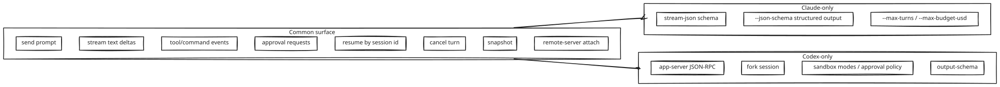

# Backends

Two backends are supported in v1: **Claude Code** and **Codex CLI**. Each one has its own native I/O surface and its own quirks; the adapter layer normalises them onto a common engine.

| Backend | Native interactive entry | Native headless entry | Native programmatic entry | Native remote note | Default driver |
|---|---|---|---|---|---|
| Claude Code | `claude` (REPL) | `claude -p ... --output-format stream-json` | (same, scripted) | Claude Remote Control exists, but is a human remote UI, not a yikes! chat transport | `direct` for headless, `tmux` for local TUI; future `remote-server` for OpenHort/web attach |
| Codex | `codex` (Ratatui TUI) | `codex exec ... --json` | `codex app-server` (JSON-RPC) | Codex websocket is useful behind a yikes! server, not as a standalone UI contract | `direct` (app-server/exec) for structured ops, `tmux` for local TUI; future `remote-server` for OpenHort/web attach |

Read each backend page for details:

- [Claude Code](claude-code.md)
- [Codex](codex.md)

## Parity surface

The engine targets the **intersection** of features both backends expose, plus opt-in extensions where one backend is uniquely capable.

Backend-specific features are reachable via `session.backend.<feature>(...)` namespaces so callers who care can use them. The common surface is `session.<method>(...)`.
