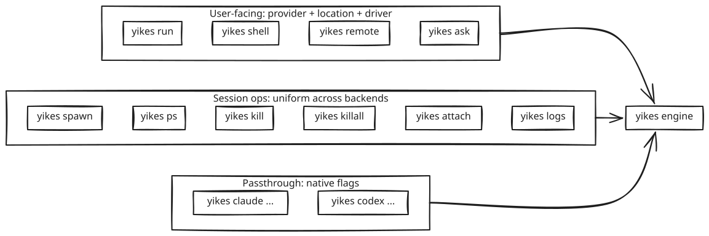

# CLI Wrapper

The CLI is a thin shell over the Python library. It must hit two notes:

1. **From a user's perspective**, the main choices are **provider** (Claude or Codex), **location** (`host`, `docker`, future `remote`), and **driver** (`cli`, `tmux`, future `api`). Location says where it runs. Driver says how yikes! drives it.
2. **For session management** (spawn, kill, list, killall, attach), the command surface is uniform across both backends — same flags, same output, same exit codes.

Native `claude` / `codex` flags are still accepted (we proxy them through), but you rarely need to set them.

## Installing on PATH

The `yikes` console script is declared as a project entry point (`[project.scripts]` in `pyproject.toml`), so a Poetry install builds it at `.venv/bin/yikes`. To make it callable from new bash and zsh shells without activating the venv, run the helper once:

```bash
bash scripts/install-path.sh
```

The script is idempotent: it symlinks the venv entrypoint into `~/.local/bin` and appends a single guarded block to `~/.zshrc` and `~/.bashrc` that keeps `~/.local/bin` on PATH. Re-running it refreshes the symlink (for example after recreating the venv) and leaves exactly one guard block per file. A plain `pip install -e .` instead exposes `yikes` on the active interpreter's PATH directly, in which case the helper is not needed.

## One-word launchers

`yikes claude` and `yikes codex` make starting a real interactive session as cheap as running `claude` or `codex` directly, while still going through a durable, reattachable tmux session (never a headless `-p`/`exec` shim).

```bash
yikes claude            # start or reattach an interactive Claude session for the current dir
yikes codex             # same, Codex
yikes claude -n shop    # explicit session name (default: the directory basename)
yikes claude -i         # run it isolated in Docker, project mounted
yikes claude --new      # replace any existing session with this name
```

Behavior:

- **Per-directory by default.** With no `-n/--name`, the session name is the current directory's basename (sanitized to tmux's `A-Za-z0-9_.-` charset). Re-running `yikes claude` in the same project reattaches the same live session instead of spawning a new one. In the dashboard tabs and `yikes sessions`, the session is shown by a git-relative label — `<repo>/<folder>` inside a repository (e.g. `fckten/dashboard`), or just the folder name outside one — unless you passed a custom `-n` name, which is shown as-is.
- **Concurrency.** Because names are per-directory, parallel sessions live in different project dirs and don't collide. Within one project, repeated launches resume the single session for that backend.
- **Drop-in.** The command starts (or reuses) the session and then `exec`s you into the live tmux UI, exactly like `yikes attach`. Detach with `Ctrl-b d` and relaunch to come back.
- **Options.** `-n/--name`, `-i/--isolated` (`-I/--no-isolated`), `--new`, `--model`, `-p/--port` (repeatable, see below), and `--cwd` to target a directory other than the current one.

### Pre-flight panel

Because the backend's TUI takes over the screen on attach, each launch first prints a short panel so the mapped ports and the leave/return keys are in front of you:

```
  yikes! · claude · host · ~/projects/shop
  session   shop   (reattach)
  config    ~/projects/shop/yikes.toml
  ports     8080, 5173

  detach    Ctrl-b d        reattach   yikes claude
  close     yikes close shop
```

Below the panel it shows an interactive menu — navigate with the arrow keys (or `j`/`k`) and press Enter:

- **Start the session** (highlighted by default)
- **Add an initial prompt** — type a first message to seed the session (see below)
- **Set up yikes.toml for this project** — runs `yikes setup` and re-renders
- **Cancel**

`Esc` or `q` cancels. Pass `-y/--yes`, set `YIKES_NO_PROMPT=1`, or run without a TTY (pipes, scripts) to print the panel and start without the menu. All of yikes' terminal menus share one look: the screen is cleared first, the panel and menu are colorized (labels, the brand, the highlighted row), and the same arrow-key selection is used everywhere. Color and screen-clearing apply only on a real terminal — piped/redirected output stays plain.

### Initial prompt for a new session

You can hand the session a first message instead of typing it after attaching — useful when you are starting fresh and want to tell the backend what to build. Provide it with `-m/--message`, or pick "Add an initial prompt" in the panel. The option is always available; yikes does not try to guess whether the project is "new".

```bash
yikes claude -m "scaffold a NiceGUI dashboard that serves on 8080"
```

The message is pre-filled into the session's input on a **new** session only (never on a reattach) and is **not auto-submitted** — yikes waits for the backend to be ready, pastes the text, and leaves it for you to review and send with Enter. The same message also biases `yikes setup`'s scan (below) so the generated config matches the intended stack.

### `yikes setup` — agentic yikes.toml

`yikes setup` (and the `s` option above) runs the backend **once in direct CLI mode** (`ask_backend(..., Driver.DIRECT, ...)`, not a tmux session) to inspect the repository — package.json scripts, vite/next/webpack config, docker-compose, Dockerfile `EXPOSE`, `.env`, Procfile — and report the HTTP ports it serves as a small JSON object. yikes then synthesizes a `yikes.toml` from that result, prints it for review, and writes it on confirmation (`--yes` skips the prompt). The instruction sent to the backend is brand-free: it asks for ports as JSON and yikes builds the file, so nothing about yikes! is injected into the backend prompt.

It runs the agent and can take a while, so yikes shows a live progress indicator instead of sitting silent. When run interactively without `-m`, it first asks, in plain language, "What is this project about, or what do you want to build here?" (press Enter to skip) — useful on an empty project where describing your intent lets the generated config and `AGENTS.md` reflect the right stack.

If the project has no `AGENTS.md`, `yikes setup` also writes a starter one (it never overwrites an existing file) describing the project from what was found and what you typed, so coding agents pick up project context. Both files are previewed and written together on confirmation.

`yikes setup` does not assume a backend. An explicit `-b/--backend` or the project's configured backend wins; otherwise it uses whichever of claude/codex is installed, and when **both** are present it asks which to use.

```bash
yikes setup                     # pick backend (asks if both installed), confirm, write
yikes setup -b codex -y         # use Codex, write without confirmation
yikes setup -m "a vite app"     # tell it what you are building
```

### `yikes` with no arguments

Bare `yikes` shows a small arrow-key chooser — claude / codex / terminal overview — and dispatches to the matching launcher or to the full dashboard (`yikes tui`). When stdin is not a TTY (pipes, scripts), it falls back to `yikes tui` so non-interactive use keeps working.

### Isolated sessions (`-i`) and ports

`-i` runs the session inside the existing Docker sandbox (`docker + tmux`): the project directory is mounted, the backend's interactive UI runs in tmux inside the container, and `yikes` `exec`s you into it via `docker exec -it`. The container reuse key is derived from the project directory and backend, so re-running `yikes claude -i` in the same project reattaches the same container.

HTTP ports are published to the host loopback so a dev server started inside the container is reachable from your browser:

- `-p 8080` publishes `127.0.0.1:8080 -> container 8080`. `-p 3000:80` remaps. Repeatable.
- If a requested host port is already in use (for example a second isolated session elsewhere), `yikes` falls back to a free ephemeral host port instead of failing the container start. The effective `http://localhost:PORT` URLs are printed before you attach.
- Ports are fixed at container-create time; change them by recreating the session (`--new`).

### Per-project config: `yikes.toml`

Per-project defaults live in a committed `yikes.toml` at (or above) the working directory, discovered by walking up from the current directory. `yikes init` scaffolds one:

```toml
backend  = "claude"        # what the bare-yikes chooser / default selects here
isolated = false           # run in Docker by default for this project?
ports    = [8080, 5173]    # published 127.0.0.1:PORT -> container when isolated
# name   = "shop"          # session name (default: directory basename)
# model  = "..."           # backend model override
```

`ports` entries accept a bare port (`8080`) or a `"host:container"` string. A sibling `yikes.local.toml` (gitignored) overlays personal overrides on top of the shared file — use it for your own ports or backend without touching the committed config. CLI flags (`-i`, `-p`, `-n`, `--model`) override the file for a single run.

### Session panes (sub-tabs)

In the web UI each session tab has **sub-tabs ("panes")**: the live **Terminal** (always present for interactive sessions) plus panes you declare under `[[panes]]`, and an optional `[[links]]` list rendered in the sidebar.

```toml
[[panes]]
kind  = "web"            # an embedded page (iframe)
title = "App"
port  = 5173             # -> http://<browser-host>:5173
# url = "http://{host}:{port}/admin"   # alternative: a template; {host}/{port} only

[[panes]]
kind  = "web"
title = "Storybook"
port  = 6006
start = "npm run storybook"   # optional: yikes runs/stops this as a tracked process

[[panes]]
kind    = "data"         # an auto-refreshing table
title   = "Health"
source  = "builtin:health"     # or: url = "http://{host}:8080/health" returning JSON
refresh = 5

[[links]]
title = "Open app"
port  = 5173
```

- **No hardcoded hosts/IPs in `yikes.toml`.** Declare a `port` (or a `url` template using only the `{host}`/`{port}` placeholders); the host is resolved in the browser from the address you used to reach yikes, so the committed file works from localhost, a LAN IP, or a VPN name. A literal host in a committed `url` is rejected — literal addresses are allowed only in the gitignored `yikes.local.toml`.
- **Web panes** show a small browser bar (URL, back/forward, reload, open-in-new-tab, and a load/unload toggle to stop hitting the server). A pane with a `start` command gets a **Start/Stop** control and a live status dot; without one, yikes just embeds the URL.
- **Add panes at runtime** with the **＋ web** button in the pane bar — type a port or full URL. Dynamic panes persist to `yikes.local.toml` (so a literal intranet URL stays personal and gitignored), never the shared file.

## Top-level shape

```
yikes [GLOBAL OPTS] COMMAND [COMMAND OPTS] [ARGS]
```

Global options:

| Flag | Description | Default |
|---|---|---|
| `-b`, `--backend {claude,codex}` | Which CLI to drive. | `claude` |
| `--location {host,docker,remote}` | Where the backend runs. `remote` is reserved for future remote-machine/server sessions. | `host` |
| `-d`, `--driver {cli,tmux,api}` | How to drive it. `api` is reserved for future structured API/app-server mode. | `cli` |
| `-s`, `--session NAME_OR_ID` | Operate on a specific session. | (new) |
| `--socket PATH_OR_NAME` | tmux socket path/name, only for `tmux`. | `~/.yikes/tmux/default.sock` |
| `--remote ADDR_OR_NAME` | Remote yikes! server endpoint/name, only for `remote-server`. | configured server |
| `--cwd PATH` | Working dir for spawned sessions. If omitted for tmux-backed sessions, yikes! creates a random workspace where the session starts. | generated for tmux, `$PWD` otherwise |
| `--web-search / --no-web-search` | Enable or disable web search for the agent config. | enabled |
| `--read-dir PATH` | Add a directory the agent may read. Repeatable. | none |
| `--write-dir PATH` | Add a directory the agent may write. Repeatable. | none |
| `--mcp "name=command args..."` | Attach an MCP server. Repeatable. | none |
| `--no-color` | Strip ANSI from output. | off |
| `-v`, `--verbose` | Engine-level logs. | off |
| `--json` | Machine-readable output (NDJSON). | off |

## Two ways to read the surface

<p align="center"></p>

## Commands

## Current implemented slice

The current package implements:

- `yikes` / `yikes tui`: a Textual chatbot control surface, default when no arguments are passed.
- `yikes chat-smoke`: an end-to-end chatbot smoke flow across backend/runtime combinations.
- `yikes sessions`: lists known yikes! sessions across durable tmux/remote metadata and Docker sandboxes.
- `yikes close <id>`: closes one known session. Docker sessions are destroyed; tmux sessions are killed when socket metadata is available; durable metadata is removed.
- `yikes close-all [--runtime docker|tmux|remote-server|all] [--backend claude|codex|all] [--yes]`: closes matching sessions in bulk. It first lists what will be closed and asks to confirm; pass `-y/--yes` to skip the prompt. Without a TTY it refuses unless `--yes` is given, so scripts can't mass-close by accident.
- `yikes attach <id> [--print-only]`: overtakes attachable local tmux and Docker+tmux sessions. Docker attach uses `docker exec -it <container> tmux ...`.
- `yikes tmux start <name> --backend claude|codex [--cwd PATH] [--model NAME] [--replace]`: starts a long-lived, named interactive tmux session. `--replace` kills any existing session with the same name first.
- `yikes tmux state <name-or-id> [--json] [--output]`: reports the inferred background state (`idle`, `thinking`, `streaming`, `awaiting-selection`, or `unknown`) and optionally the recent terminal output.
- `yikes tmux send <name-or-id> "text" [--no-submit] [--wait --timeout SECONDS]`: pastes text into the interactive session, optionally presses Enter, and can wait until the session settles or asks for input.
- `yikes tmux wait <name-or-id> --timeout SECONDS`: waits for a named session to become stable or ask a question.
- `yikes tmux kill <name-or-id>`: kills the tmux session and removes its durable metadata.
- `yikes token` / `yikes server`: creates hashed bearer tokens and starts the yikes! WebSocket control plane.
- Shared slash-command registry with autocomplete for `/model`, `/models`, `/backend`, `/location`, `/mode`, `/driver`, `/sessions`, `/switch`, `/close`, `/close-all`, `/complexity`, `/web`, `/dirs`, `/mcp`, `/set`, `/restart`, and `/exit`.
- **`/set <key> <value>`** (aliases `/config`, `/cfg`) is the single command for all session config updates — `model`, `complexity`, `web`, the display `icon`/`name`/`description`, and any other custom key (written into the session's record). One command rather than one per property. Display metadata lives in the session's own durable record (`~/.yikes/sessions/<id>.json`), so it is shared by the TUI and the web UI. In the web UI you can also **right-click a session tab** to edit its icon, name and description in a dialog.
- Persisted app state in `~/.config/yikes/state.json` covering backend, effective runtime, model, complexity, web search, read/write directories, and MCP servers.
- The Textual UI exposes backend, location, driver, model, complexity, web-search, session inventory, switch, attach, close, close Docker, close tmux, and close all controls in the left panel.

### Web UI (`yikes web`)

`yikes web` serves the browser control UI (FastAPI + uvicorn) backed by the same controller as the terminal app.

```bash
yikes web                       # serve on http://127.0.0.1:8760 and open a browser
yikes web --host 0.0.0.0 --port 9000 --no-open
yikes web --url                 # print the login URL (with key) and exit; don't start
```

Flags: `--host` (default `0.0.0.0`, all interfaces; use `127.0.0.1` for loopback only), `--port` (default `8760`), `--cwd` (default start dir for new sessions), `--dev/--no-dev`, `--open/--no-open`, `--persistent-auth/--ephemeral-auth`, and `--url`.

**HTTPS by default.** `yikes web` serves **HTTPS** using a self-signed certificate auto-generated with `openssl` (cached in `~/.yikes/web-cert.pem` / `web-key.pem`, SAN covering `localhost`, `127.0.0.1`, and the machine's LAN IPs). This is required because browsers only allow the **microphone** (voice input) on a *secure context* — HTTPS or localhost — so a plain-`http` LAN address can never use the mic. Accept the one-time self-signed-cert warning in the browser. Pass `--no-tls` to serve plain HTTP instead (e.g. when fronting yikes with your own TLS proxy); if a cert can't be generated (no `openssl`), it falls back to HTTP with a warning. Only the working (`https`) login URLs are advertised on startup.

**Authentication.** The UI is gated by a login key. It is persisted **user-globally** in `~/.yikes/web-auth.env` (as `YIKES_WEB_LOGIN_KEY`) so it is the same regardless of which directory you launch from — `yikes web --url` therefore always matches the running server. Override the location with the `YIKES_WEB_ENV` environment variable. `/login` accepts the key on a form or as `?key=…`, then sets a session cookie. `--ephemeral-auth` mints a throwaway key for that run instead of persisting one. `yikes web --url` reads the persisted key and prints the full `…/login?key=…` URL without starting the server — useful for logging in from another machine without copying the key by hand. The key is a 256-bit random token compared in constant time, and login is **rate-limited per client**: each wrong guess locks that address out for an exponentially growing window (1s, 2s, 4s, … capped at 60s) and returns `429`, so the key cannot be brute-forced even though the server listens on the network by default.

**No hot-reload.** The server is a long-running process that serves whatever code was imported at startup. After updating yikes (or landing changes that touch the web server or the modules it imports), restart it: stop the running server (it does not restart a live port itself) and run `yikes web` again. Keep it durable with a detached `tmux new-session -d -s yikes-web-<port> "yikes web …"` so it survives the shell.

**Advertised URLs.** On startup the server prints a login URL for every host it is actually reachable on. Bound to all interfaces (the default) it prints a working `http://<lan-ip>:<port>/login?key=…` for each real network interface, so you can copy one straight to another machine. Bound to `--host 127.0.0.1` it prints just the loopback URL plus a hint showing the LAN address and the `--host 0.0.0.0` command to make it reachable. `yikes web --url` prints a single best URL — the LAN address when bound to all interfaces, otherwise the bind host. If the port is already in use (e.g. another `yikes web` is running), it reports that cleanly instead of a bind traceback.

**Labeling activity state.** When the top-bar activity reading is wrong, click the **◉** button (or press **Ctrl+Alt+L**) to record what the terminal *actually* shows as a training sample — see [Activity & Training](activity-training.md).

**Image links.** Agents reference pasted/generated images as local file links (e.g. Claude/Codex `[Image #N]`). tmux sessions are created with `allow-passthrough on` and the `hyperlinks` terminal-feature so those OSC 8 links and inline-image escapes survive tmux to native terminals and the web xterm. In the browser, clicking such a link (or a visible absolute image path) opens it through the authenticated **`GET /file?path=…`** endpoint, which streams the image. That route is gated by the **same login cookie** as everything else and only serves existing image files (by MIME/extension, ≤ 50 MB) — it is not a general file-read surface. Browsers can't open `file://` paths directly, which is why the endpoint exists.

**Remote access.** Two ways to reach it from another machine:

- *Same network, direct (default):* the server already listens on all interfaces, so open one of the printed `http://<lan-ip>:<port>/login?key=…` URLs from the other machine. The login key (rate-limited, 256-bit) is the guard; front it with a mesh VPN such as Tailscale if you want it reachable beyond the LAN.
- *Loopback only + secure tunnel:* start with `--host 127.0.0.1` and SSH local-forward. From a Windows PC:

  ```powershell
  ssh -L 8760:localhost:8760 you@mac          # tunnel (separate window)
  Start-Process (ssh you@mac "cd ~/projects/yikes && yikes web --url")
  ```

  The SSH channel carries the key (it never leaves the encrypted connection), and through the tunnel the printed `127.0.0.1:8760` URL resolves to the Mac.

The command set below is still the larger target CLI design.

### `yikes ask` — one-shot, headless

The "I just want the answer" entry point. Maps to `claude -p` / `codex exec --json`.

```bash
yikes ask "explain @src/auth.py"
yikes ask -b codex "summarise this diff" < diff.txt   # prompt + piped stdin
yikes ask --image screenshot.png "what's broken here?"
yikes ask "hello" --json                              # structured output
```

- Default driver: `direct`.
- Default output: streamed assistant text to stdout, nothing else.
- `--json` emits NDJSON events (the engine's stream).
- Exit codes: `0` success, `1` runtime error, `2` arg error.

### `yikes run` — open a turn, stream events to stdout

The middle ground: live streaming view, optionally interactive (e.g. answering approval prompts).

```bash
yikes run "refactor src/auth.py to use httpx"
yikes -b codex run "implement the parser sketch in TODO.md"
```

- Default driver: `tmux` (so approvals work).
- Output: pretty-printed event stream. Looks like watching the CLI live, but rendered by us.
- `--json` for NDJSON output.
- Approvals: prompts the user on stdin (`y/n`).
- `Ctrl+C`: cancels the turn, leaves the session alive. Second `Ctrl+C` kills.

### `yikes shell` — interactive session

For people who *want* the full TUI experience but routed through our infrastructure:

```bash
yikes shell                    # claude TUI, attached
yikes -b codex shell
```

This effectively does `yikes spawn` + `yikes attach`. Detaches cleanly on `Ctrl+B D` (tmux's standard detach key).

### `yikes remote` — remote yikes! server session

```bash
yikes server --listen 127.0.0.1:8989
yikes remote --url http://127.0.0.1:8989 --session release-prep
yikes -b codex remote --url http://127.0.0.1:8989
```

- Default driver: `remote-server`.
- The remote host runs yikes! and owns Claude/Codex process lifecycle.
- Clients authenticate with scoped bearer tokens.
- Remote sessions are listed in `yikes ps` like any other session.
- Claude Remote Control is not used for this chat transport; it is a Claude human remote UI.

### `yikes spawn` — create a session, don't attach

```bash
yikes spawn                                          # spawns claude session
yikes -b codex spawn --name release-prep             # named codex session
yikes spawn --resume <native-id>                      # resume an existing native session
yikes spawn --model opus-4-7 --append-system-prompt "Be terse"
```

Prints the session ID on stdout. `--json` adds `SessionInfo` as JSON.

### `yikes ps` / `yikes list` — list sessions

```bash
yikes ps
# ID          NAME              BACKEND  DRIVER  STATE       MODEL       TURNS  COST    AGE
# yik_3f9a   release-prep      codex    tmux    READY       gpt-5.5     3      $0.42   12m
# yik_7b21   (auto-1742...)    claude   tmux    STREAMING   opus-4-7    1      $0.11   34s

yikes ps --json
yikes ps --backend claude          # filter
yikes ps --state ready             # filter
```

Both backends in one table. The CLI doesn't care which is which beyond the column.

### `yikes kill` — terminate a session

```bash
yikes kill yik_3f9a                # by ID
yikes kill release-prep            # by name
yikes kill --all-codex             # all codex sessions, leave claude alive
```

### `yikes killall` — nuke everything

```bash
yikes killall                      # kills all sessions on our socket
yikes killall --dry-run            # show what would die
```

Convenience wrapper around the active drivers: tmux `kill-server` for our socket path, direct subprocess shutdown, remote-server detach/stop where supported, plus cleanup of our state directory.

### `yikes attach` — open a session in the user's terminal

```bash
yikes attach yik_3f9a
# local tmux: drops into tmux
# Docker+tmux: docker exec -it <container> tmux -S /workspace/yikes-tmux.sock attach -t <session>
```

Prints the tmux attach command or remote-server attach metadata if invoked with `--print-only` (for embedding in IDE integrations).

### `yikes capture` — record a labeled state sample (developer)

Hidden from `yikes --help`. Records ground-truth training samples for the
activity detector by grabbing several rapid full-colour terminal snapshots of a
live session and storing them with the true state label.

```bash
yikes capture awaiting-selection         # auto-picks the running session for this dir
yikes capture streaming <id|name>        # target a session explicitly
yikes capture idle --frames 6 --span 0.8 --notes "post-turn prompt"
```

See [Activity & Training](activity-training.md) for the states, storage layout,
and `meta.json` fields.

### `yikes logs` — replay or tail a session's events

```bash
yikes logs yik_3f9a                # print full transcript
yikes logs yik_3f9a --since 5m
yikes logs yik_3f9a --follow       # tail live
yikes logs yik_3f9a --format text  # human-readable (default: JSON)
```

### `yikes claude` / `yikes codex` — passthrough

For when you genuinely want to invoke the native CLI through our infrastructure with all its flags intact:

```bash
yikes claude --resume abc123 --append-system-prompt "Be terse" -p "summary?"
yikes codex exec --sandbox workspace-write --output-schema schema.json "extract todos"
```

Unknown flags are passed through verbatim to the underlying CLI. We just wrap the I/O.

## Defaults — what the user doesn't have to think about

| Concern | Default |
|---|---|
| tmux socket | `~/.yikes/tmux/default.sock` under a `0700` directory |
| Pane size | 200×50 |
| Approval policy | Ask interactively if running on a TTY; auto-fail if running headless |
| Transcript persistence | On, at `~/.yikes/sessions/` |
| Native session persistence | On (we don't pass `--no-session-persistence` / `--ephemeral`) |
| Driver | `auto` — `direct` for `ask` and passthrough `-p`/`exec`, `tmux` for local `run`/`shell`/`spawn`, `remote-server` for `remote` |
| Frame sync | On |
| Coalesce window | 80 ms |

## Subcommand → operation matrix

| Command | Spawns? | Streams? | Interactive? | Default driver |
|---|---|---|---|---|
| `ask` | yes, ephemeral | yes | no (rejects approval) | `direct` |
| `run` | yes (or use `-s`) | yes | yes (approvals) | `tmux` |
| `shell` | yes (or `-s`) | yes (visible TUI) | full TUI | `tmux` |
| `remote` | yes (or use `-s`) | yes | remote yikes! API | `remote-server` |
| `spawn` | yes | no (just prints ID) | no | `tmux` |
| `ps` | no | no | no | n/a |
| `kill` | no | no | no | n/a |
| `killall` | no | no | no | n/a |
| `attach` | no (existing) | yes (TUI) | full TUI | `tmux` |
| `logs` | no | optional `--follow` | no | n/a |
| `claude`/`codex` | yes | yes | depends on subflag | per native flag (e.g. `-p` → `direct`) |

## Output formats

### Pretty (default)

For human-readable streaming:

```text
[claude:yik_7b21] turn started
  Sure — I'll refactor src/auth.py to use httpx.
  ⏵ Read src/auth.py
  ⏵ Edit src/auth.py
  [approval] Run npm test? [y/n] _
  ✓ npm test (12s)
  ✓ Turn complete (in 32s, $0.11, 3450 in / 890 out)
```

### `--json` (NDJSON)

One event per line, the engine's normalised event schema:

```json
{"type":"turn_start","session_id":"yik_7b21","turn_id":"t1","ts":171234.567}
{"type":"stream_delta","session_id":"yik_7b21","seq":12,"text":"Sure — ","block_id":"b0"}
{"type":"tool_use","session_id":"yik_7b21","seq":18,"tool":"Read","input":{"path":"src/auth.py"},"tool_use_id":"toolu_1"}
{"type":"approval_request","session_id":"yik_7b21","seq":24,"prompt":"Run npm test?","options":["yes","no"],"request_id":"r1"}
{"type":"turn_complete","session_id":"yik_7b21","seq":36,"stop_reason":"end_turn","usage":{"input_tokens":3450,"output_tokens":890,"cost_usd":0.11}}
```

### `--format text`

ANSI-stripped text-only output (like the assistant's response, no chrome). Maps to `result` field for headless ops.

## Exit codes

| Code | Meaning |
|---|---|
| `0` | Success |
| `1` | Runtime error (backend exit non-zero, session crashed, etc.) |
| `2` | Argument error |
| `3` | Approval denied / approval timeout |
| `4` | Budget / turn-limit exceeded |
| `5` | Backend binary not found |
| `6` | tmux unavailable (with `--driver tmux`) |
| `7` | Session not found |
| `8` | Remote server unavailable or refused |

`yikes ask --json` and `yikes run --json` exit `0` if the event stream completes cleanly, regardless of whether the assistant said "I don't know." Failure means an *infrastructure* failure.

## Composability examples

```bash
# Run two sessions in parallel, collect outputs
yikes spawn --name task1 --json
yikes spawn -b codex --name task2 --json

yikes run -s task1 "refactor auth" --json | jq 'select(.type=="stream_delta") | .text' &
yikes run -s task2 "write tests"   --json | jq 'select(.type=="stream_delta") | .text' &
wait
```

```bash
# Cost report across all live sessions
yikes ps --json | jq '[.[].cost_usd] | add'
```

```bash
# Headless lint pipeline
git diff main | yikes ask --json \
  --append-system-prompt "You are a code linter. Return ONLY issues found, one per line." \
  | jq -r 'select(.type=="stream_delta") | .text'
```

## Backend parity table — same command, both work

| What you want | `yikes` form | Maps to (claude) | Maps to (codex) |
|---|---|---|---|
| One-shot | `yikes ask "..."` | `claude -p "..." --output-format stream-json` | `codex exec "..." --json` |
| Long session | `yikes spawn` + `yikes run -s id "..."` | TUI inside tmux, send-keys | TUI inside tmux **or** `app-server` |
| Remote server | `yikes remote` | yikes! server owns Claude session | yikes! server owns Codex session |
| Resume | `yikes spawn --resume <id>` | `claude --resume <id>` | `codex resume <id>` |
| List sessions | `yikes ps` | (none natively) | `thread/list` via app-server |
| Kill one | `yikes kill <id>` | (none natively) | (kill app-server thread) |
| Killall | `yikes killall` | (none natively) | (none natively) |
| Attach to running TUI | `yikes attach <id>` | tmux attach | tmux attach |
| Replay transcript | `yikes logs <id>` | read `~/.claude/projects/...` | read `~/.codex/sessions/...` |

Note where the native CLI has no equivalent — those rows are why this wrapper exists.

## Implementation notes

- Built on **Typer** (Click underneath). Each command is a Python function decorated with `@app.command()`.
- Async commands use `asyncio.run()` at the entry; the rest of the library is fully async.
- Streaming output uses `rich.console.Console` for ANSI rendering, with `--no-color` toggling that off.
- The CLI never imports `pyte`, `libtmux`, or any backend SDK directly — only `yikes.Session`, `yikes.Manager`. That guarantees parity.

## Six-mode test matrix

Every release must run a smoke test for all six backend/runtime combinations:

| Backend | Driver | Smoke command |
|---|---|---|
| Claude | `direct` | `yikes -b claude -d direct ask "ping"` |
| Claude | `tmux` | `yikes -b claude -d tmux run "ping"` |
| Claude | `remote-server` | `yikes -b claude -d remote-server remote --url http://127.0.0.1:8989` |
| Codex | `direct` | `yikes -b codex -d direct ask "ping"` |
| Codex | `tmux` | `yikes -b codex -d tmux run "ping"` |
| Codex | `remote-server` | `yikes -b codex -d remote-server remote --url http://127.0.0.1:8989` |
