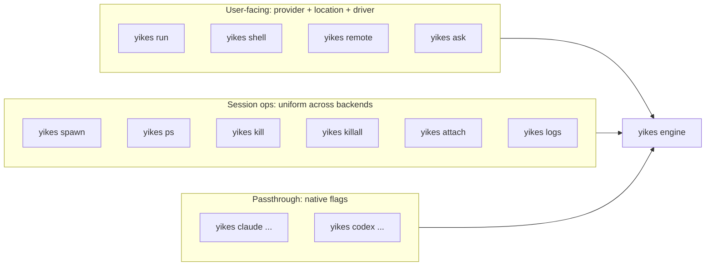

# CLI Wrapper

The CLI is a thin shell over the Python library. It must hit two notes:

1. **From a user's perspective**, the main choices are **provider** (Claude or Codex), **location** (`host`, `docker`, future `remote`), and **driver** (`cli`, `tmux`, future `api`). Location says where it runs. Driver says how yikes! drives it.
2. **For session management** (spawn, kill, list, killall, attach), the command surface is uniform across both backends — same flags, same output, same exit codes.

Native `claude` / `codex` flags are still accepted (we proxy them through), but you rarely need to set them.

## Top-level shape

```
yikes [GLOBAL OPTS] COMMAND [COMMAND OPTS] [ARGS]
```

Global options:

| Flag | Description | Default |
|---|---|---|
| `-b`, `--backend {claude,codex}` | Which CLI to drive. | `claude` |
| `--location {host,docker,remote}` | Where the backend runs. `remote` is reserved for future remote-machine/server sessions. | `host` |
| `-d`, `--driver {cli,tmux,api}` | How to drive it. `api` is reserved for future structured API/app-server mode. | `cli` |
| `-s`, `--session NAME_OR_ID` | Operate on a specific session. | (new) |
| `--socket PATH_OR_NAME` | tmux socket path/name, only for `tmux`. | `~/.yikes/tmux/default.sock` |
| `--remote ADDR_OR_NAME` | Remote yikes! server endpoint/name, only for `remote-server`. | configured server |
| `--cwd PATH` | Working dir for spawned sessions. If omitted for tmux-backed sessions, yikes! creates a random workspace where the session starts. | generated for tmux, `$PWD` otherwise |
| `--web-search / --no-web-search` | Enable or disable web search for the agent config. | enabled |
| `--read-dir PATH` | Add a directory the agent may read. Repeatable. | none |
| `--write-dir PATH` | Add a directory the agent may write. Repeatable. | none |
| `--mcp "name=command args..."` | Attach an MCP server. Repeatable. | none |
| `--no-color` | Strip ANSI from output. | off |
| `-v`, `--verbose` | Engine-level logs. | off |
| `--json` | Machine-readable output (NDJSON). | off |

## Two ways to read the surface



## Commands

## Current implemented slice

The current package implements:

- `yikes` / `yikes tui`: a Textual chatbot control surface, default when no arguments are passed.
- `yikes chat-smoke`: an end-to-end chatbot smoke flow across backend/runtime combinations.
- `yikes sessions`: lists known yikes! sessions across durable tmux/remote metadata and Docker sandboxes.
- `yikes close <id>`: closes one known session. Docker sessions are destroyed; tmux sessions are killed when socket metadata is available; durable metadata is removed.
- `yikes close-all --runtime docker|tmux|remote-server|all --backend claude|codex|all`: closes matching sessions in bulk.
- `yikes attach <id> [--print-only]`: overtakes attachable local tmux and Docker+tmux sessions. Docker attach uses `docker exec -it <container> tmux ...`.
- `yikes tmux start <name> --backend claude|codex [--cwd PATH] [--model NAME] [--replace]`: starts a long-lived, named interactive tmux session. `--replace` kills any existing session with the same name first.
- `yikes tmux state <name-or-id> [--json] [--output]`: reports the inferred background state (`idle`, `thinking`, `streaming`, `awaiting-selection`, or `unknown`) and optionally the recent terminal output.
- `yikes tmux send <name-or-id> "text" [--no-submit] [--wait --timeout SECONDS]`: pastes text into the interactive session, optionally presses Enter, and can wait until the session settles or asks for input.
- `yikes tmux wait <name-or-id> --timeout SECONDS`: waits for a named session to become stable or ask a question.
- `yikes tmux kill <name-or-id>`: kills the tmux session and removes its durable metadata.
- `yikes token` / `yikes server`: creates hashed bearer tokens and starts the yikes! WebSocket control plane.
- Shared slash-command registry with autocomplete for `/model`, `/models`, `/backend`, `/location`, `/mode`, `/driver`, `/sessions`, `/switch`, `/close`, `/close-all`, `/complexity`, `/web`, `/dirs`, `/mcp`, `/restart`, and `/exit`.
- Persisted app state in `~/.config/yikes/state.json` covering backend, effective runtime, model, complexity, web search, read/write directories, and MCP servers.
- The Textual UI exposes backend, location, driver, model, complexity, web-search, session inventory, switch, attach, close, close Docker, close tmux, and close all controls in the left panel.

The command set below is still the larger target CLI design.

### `yikes ask` — one-shot, headless

The "I just want the answer" entry point. Maps to `claude -p` / `codex exec --json`.

```bash
yikes ask "explain @src/auth.py"
yikes -b codex ask "summarise this diff" < diff.txt
yikes ask --image screenshot.png "what's broken here?"
```

- Default driver: `direct`.
- Default output: streamed assistant text to stdout, nothing else.
- `--json` emits NDJSON events (the engine's stream).
- Exit codes: `0` success, `1` runtime error, `2` arg error.

### `yikes run` — open a turn, stream events to stdout

The middle ground: live streaming view, optionally interactive (e.g. answering approval prompts).

```bash
yikes run "refactor src/auth.py to use httpx"
yikes -b codex run "implement the parser sketch in TODO.md"
```

- Default driver: `tmux` (so approvals work).
- Output: pretty-printed event stream. Looks like watching the CLI live, but rendered by us.
- `--json` for NDJSON output.
- Approvals: prompts the user on stdin (`y/n`).
- `Ctrl+C`: cancels the turn, leaves the session alive. Second `Ctrl+C` kills.

### `yikes shell` — interactive session

For people who *want* the full TUI experience but routed through our infrastructure:

```bash
yikes shell                    # claude TUI, attached
yikes -b codex shell
```

This effectively does `yikes spawn` + `yikes attach`. Detaches cleanly on `Ctrl+B D` (tmux's standard detach key).

### `yikes remote` — remote yikes! server session

```bash
yikes server --listen 127.0.0.1:8989
yikes remote --url http://127.0.0.1:8989 --session release-prep
yikes -b codex remote --url http://127.0.0.1:8989
```

- Default driver: `remote-server`.
- The remote host runs yikes! and owns Claude/Codex process lifecycle.
- Clients authenticate with scoped bearer tokens.
- Remote sessions are listed in `yikes ps` like any other session.
- Claude Remote Control is not used for this chat transport; it is a Claude human remote UI.

### `yikes spawn` — create a session, don't attach

```bash
yikes spawn                                          # spawns claude session
yikes -b codex spawn --name release-prep             # named codex session
yikes spawn --resume <native-id>                      # resume an existing native session
yikes spawn --model opus-4-7 --append-system-prompt "Be terse"
```

Prints the session ID on stdout. `--json` adds `SessionInfo` as JSON.

### `yikes ps` / `yikes list` — list sessions

```bash
yikes ps
# ID          NAME              BACKEND  DRIVER  STATE       MODEL       TURNS  COST    AGE
# yik_3f9a   release-prep      codex    tmux    READY       gpt-5.5     3      $0.42   12m
# yik_7b21   (auto-1742...)    claude   tmux    STREAMING   opus-4-7    1      $0.11   34s

yikes ps --json
yikes ps --backend claude          # filter
yikes ps --state ready             # filter
```

Both backends in one table. The CLI doesn't care which is which beyond the column.

### `yikes kill` — terminate a session

```bash
yikes kill yik_3f9a                # by ID
yikes kill release-prep            # by name
yikes kill --all-codex             # all codex sessions, leave claude alive
```

### `yikes killall` — nuke everything

```bash
yikes killall                      # kills all sessions on our socket
yikes killall --dry-run            # show what would die
```

Convenience wrapper around the active drivers: tmux `kill-server` for our socket path, direct subprocess shutdown, remote-server detach/stop where supported, plus cleanup of our state directory.

### `yikes attach` — open a session in the user's terminal

```bash
yikes attach yik_3f9a
# local tmux: drops into tmux
# Docker+tmux: docker exec -it <container> tmux -S /workspace/yikes-tmux.sock attach -t <session>
```

Prints the tmux attach command or remote-server attach metadata if invoked with `--print-only` (for embedding in IDE integrations).

### `yikes logs` — replay or tail a session's events

```bash
yikes logs yik_3f9a                # print full transcript
yikes logs yik_3f9a --since 5m
yikes logs yik_3f9a --follow       # tail live
yikes logs yik_3f9a --format text  # human-readable (default: JSON)
```

### `yikes claude` / `yikes codex` — passthrough

For when you genuinely want to invoke the native CLI through our infrastructure with all its flags intact:

```bash
yikes claude --resume abc123 --append-system-prompt "Be terse" -p "summary?"
yikes codex exec --sandbox workspace-write --output-schema schema.json "extract todos"
```

Unknown flags are passed through verbatim to the underlying CLI. We just wrap the I/O.

## Defaults — what the user doesn't have to think about

| Concern | Default |
|---|---|
| tmux socket | `~/.yikes/tmux/default.sock` under a `0700` directory |
| Pane size | 200×50 |
| Approval policy | Ask interactively if running on a TTY; auto-fail if running headless |
| Transcript persistence | On, at `~/.yikes/sessions/` |
| Native session persistence | On (we don't pass `--no-session-persistence` / `--ephemeral`) |
| Driver | `auto` — `direct` for `ask` and passthrough `-p`/`exec`, `tmux` for local `run`/`shell`/`spawn`, `remote-server` for `remote` |
| Frame sync | On |
| Coalesce window | 80 ms |

## Subcommand → operation matrix

| Command | Spawns? | Streams? | Interactive? | Default driver |
|---|---|---|---|---|
| `ask` | yes, ephemeral | yes | no (rejects approval) | `direct` |
| `run` | yes (or use `-s`) | yes | yes (approvals) | `tmux` |
| `shell` | yes (or `-s`) | yes (visible TUI) | full TUI | `tmux` |
| `remote` | yes (or use `-s`) | yes | remote yikes! API | `remote-server` |
| `spawn` | yes | no (just prints ID) | no | `tmux` |
| `ps` | no | no | no | n/a |
| `kill` | no | no | no | n/a |
| `killall` | no | no | no | n/a |
| `attach` | no (existing) | yes (TUI) | full TUI | `tmux` |
| `logs` | no | optional `--follow` | no | n/a |
| `claude`/`codex` | yes | yes | depends on subflag | per native flag (e.g. `-p` → `direct`) |

## Output formats

### Pretty (default)

For human-readable streaming:

```text
[claude:yik_7b21] turn started
  Sure — I'll refactor src/auth.py to use httpx.
  ⏵ Read src/auth.py
  ⏵ Edit src/auth.py
  [approval] Run npm test? [y/n] _
  ✓ npm test (12s)
  ✓ Turn complete (in 32s, $0.11, 3450 in / 890 out)
```

### `--json` (NDJSON)

One event per line, the engine's normalised event schema:

```json
{"type":"turn_start","session_id":"yik_7b21","turn_id":"t1","ts":171234.567}
{"type":"stream_delta","session_id":"yik_7b21","seq":12,"text":"Sure — ","block_id":"b0"}
{"type":"tool_use","session_id":"yik_7b21","seq":18,"tool":"Read","input":{"path":"src/auth.py"},"tool_use_id":"toolu_1"}
{"type":"approval_request","session_id":"yik_7b21","seq":24,"prompt":"Run npm test?","options":["yes","no"],"request_id":"r1"}
{"type":"turn_complete","session_id":"yik_7b21","seq":36,"stop_reason":"end_turn","usage":{"input_tokens":3450,"output_tokens":890,"cost_usd":0.11}}
```

### `--format text`

ANSI-stripped text-only output (like the assistant's response, no chrome). Maps to `result` field for headless ops.

## Exit codes

| Code | Meaning |
|---|---|
| `0` | Success |
| `1` | Runtime error (backend exit non-zero, session crashed, etc.) |
| `2` | Argument error |
| `3` | Approval denied / approval timeout |
| `4` | Budget / turn-limit exceeded |
| `5` | Backend binary not found |
| `6` | tmux unavailable (with `--driver tmux`) |
| `7` | Session not found |
| `8` | Remote server unavailable or refused |

`yikes ask --json` and `yikes run --json` exit `0` if the event stream completes cleanly, regardless of whether the assistant said "I don't know." Failure means an *infrastructure* failure.

## Composability examples

```bash
# Run two sessions in parallel, collect outputs
yikes spawn --name task1 --json
yikes spawn -b codex --name task2 --json

yikes run -s task1 "refactor auth" --json | jq 'select(.type=="stream_delta") | .text' &
yikes run -s task2 "write tests"   --json | jq 'select(.type=="stream_delta") | .text' &
wait
```

```bash
# Cost report across all live sessions
yikes ps --json | jq '[.[].cost_usd] | add'
```

```bash
# Headless lint pipeline
git diff main | yikes ask --json \
  --append-system-prompt "You are a code linter. Return ONLY issues found, one per line." \
  | jq -r 'select(.type=="stream_delta") | .text'
```

## Backend parity table — same command, both work

| What you want | `yikes` form | Maps to (claude) | Maps to (codex) |
|---|---|---|---|
| One-shot | `yikes ask "..."` | `claude -p "..." --output-format stream-json` | `codex exec "..." --json` |
| Long session | `yikes spawn` + `yikes run -s id "..."` | TUI inside tmux, send-keys | TUI inside tmux **or** `app-server` |
| Remote server | `yikes remote` | yikes! server owns Claude session | yikes! server owns Codex session |
| Resume | `yikes spawn --resume <id>` | `claude --resume <id>` | `codex resume <id>` |
| List sessions | `yikes ps` | (none natively) | `thread/list` via app-server |
| Kill one | `yikes kill <id>` | (none natively) | (kill app-server thread) |
| Killall | `yikes killall` | (none natively) | (none natively) |
| Attach to running TUI | `yikes attach <id>` | tmux attach | tmux attach |
| Replay transcript | `yikes logs <id>` | read `~/.claude/projects/...` | read `~/.codex/sessions/...` |

Note where the native CLI has no equivalent — those rows are why this wrapper exists.

## Implementation notes

- Built on **Typer** (Click underneath). Each command is a Python function decorated with `@app.command()`.
- Async commands use `asyncio.run()` at the entry; the rest of the library is fully async.
- Streaming output uses `rich.console.Console` for ANSI rendering, with `--no-color` toggling that off.
- The CLI never imports `pyte`, `libtmux`, or any backend SDK directly — only `yikes.Session`, `yikes.Manager`. That guarantees parity.

## Six-mode test matrix

Every release must run a smoke test for all six backend/runtime combinations:

| Backend | Driver | Smoke command |
|---|---|---|
| Claude | `direct` | `yikes -b claude -d direct ask "ping"` |
| Claude | `tmux` | `yikes -b claude -d tmux run "ping"` |
| Claude | `remote-server` | `yikes -b claude -d remote-server remote --url http://127.0.0.1:8989` |
| Codex | `direct` | `yikes -b codex -d direct ask "ping"` |
| Codex | `tmux` | `yikes -b codex -d tmux run "ping"` |
| Codex | `remote-server` | `yikes -b codex -d remote-server remote --url http://127.0.0.1:8989` |
