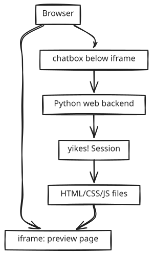

# Embedding yikes!

yikes! must be easy to use from Python because future products may embed it instead of launching the terminal UI. One target shape is a web page editor: the edited website is shown in an iframe and a chatbox below sends instructions to yikes! to modify the HTML.

## Current Python Surface

The current implementation exposes a small synchronous session facade:

```python
from pathlib import Path
from yikes import AgentSettings, Backend, ChatService, Driver

service = ChatService()
session = service.create_session(
    Backend.CLAUDE,
    Driver.DIRECT,
    cwd=Path("/path/to/site"),
    settings=AgentSettings(
        web_search_enabled=True,
        read_roots=(Path("/path/to/site"),),
        write_roots=(Path("/path/to/site"),),
    ),
)

answer = session.prompt("Change the headline to 'Hello Michael'.")
```

`Session` keeps the conversation history and command registry in memory. It is intentionally not tied to Textual, so a FastAPI route, notebook, worker, or OpenHort plugin can keep one `Session` per browser/editor session.

## Website Editor Shape

<p align="center"></p>

The browser should not talk directly to Claude or Codex. It talks to your Python backend, and the backend owns the yikes! session.

Minimal FastAPI-style sketch:

```python
from pathlib import Path
from fastapi import FastAPI
from pydantic import BaseModel
from yikes import AgentSettings, Backend, ChatService, Driver

SITE_ROOT = Path("/path/to/site").resolve()

app = FastAPI()
sessions = {}

class ChatRequest(BaseModel):
    editor_session_id: str
    message: str

@app.post("/chat")
def chat(req: ChatRequest):
    session = sessions.get(req.editor_session_id)
    if session is None:
        session = ChatService().create_session(
            Backend.CLAUDE,
            Driver.DIRECT,
            cwd=SITE_ROOT,
            settings=AgentSettings(
                read_roots=(SITE_ROOT,),
                write_roots=(SITE_ROOT,),
            ),
        )
        sessions[req.editor_session_id] = session

    answer = session.prompt(
        "You are editing the website in the iframe. "
        "Modify only files under the configured write roots.\n\n"
        f"User request: {req.message}"
    )
    return {"answer": answer, "session_id": session.id}
```

For the later daemon/server implementation, this same route should call `Manager.get()` / `Manager.spawn()` instead of storing sessions in a process-local dict. The browser contract stays the same.

If the session lives in a separate yikes! daemon, the backend can attach with the remote client instead of importing the local service:

```python
from yikes import AgentSettings, RemoteClient, RemoteClientConfig

client = RemoteClient(RemoteClientConfig("ws://127.0.0.1:8989", token=YIKES_TOKEN))
created = await client.create_session(
    backend="claude",
    driver="direct",
    cwd=SITE_ROOT,
    settings=AgentSettings(read_roots=(SITE_ROOT,), write_roots=(SITE_ROOT,)),
)
answer = await client.prompt(created["session"]["session_id"], req.message)
```

## Required Editor Capabilities

For iframe editing to be reliable, yikes! needs these capabilities at the manager/runtime layer:

- stable session ID per browser editor tab
- read/write directory grants for the site root
- an event stream so the chatbox can show progress and tool calls
- file-change events so the iframe can reload or hot-update
- cancellation for long turns
- transcript replay after browser refresh
- optional screenshot/browser MCP tools for visual feedback

The initial `Session.prompt()` facade is enough for a simple synchronous prototype. The long-lived manager is the required production shape.
