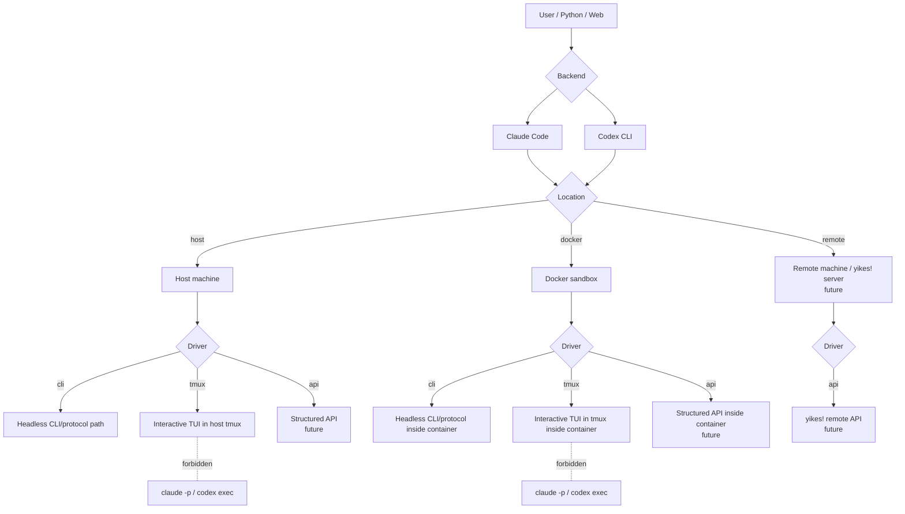

# yikes!

yikes! is a runtime layer for **Claude Code** and **Codex CLI**. It gives Python apps, web backends, and terminal users one consistent way to start sessions, choose where they run, choose how they are driven, attach MCPs, manage credentials, and overtake long-running interactive work.

The key idea is simple: choose **where** the agent runs (`host`, `docker`, remote machines in the future) separately from **how** yikes! drives it (`cli`, `tmux`, API in the future). That keeps fast headless calls, real interactive tmux sessions, Docker isolation, and future remote servers composable instead of forcing them into one overloaded mode switch.

---

## What yikes! Does

yikes! is designed as one runtime with multiple faces:

1. **Terminal app** — `yikes` opens a full-screen control surface by default.
2. **Python library** — Python code can create sessions, send prompts, inspect status, and use the same command registry as the UI.
3. **Web backend surface** — web apps can embed yikes! behind an iframe-plus-chat workflow without owning Claude/Codex process control.
4. **Shared runtime** — the same service layer owns backend selection, location/driver mapping, policy, credentials, MCP routing, sessions, and attach commands.

The UI keeps session navigation visible and moves rarely changed configuration into commands:

- Session tabs live across the top and represent reconnectable durable sessions.
- The sidebar shows compact status plus session actions only.
- `/backend`, `/location`, `/driver`, `/model`, `/complexity`, `/web`, `/dirs`, and `/mcp` are the canonical controls.
- `/new` opens a question-style chooser instead of immediately starting. The composer is hidden, Up/Down select the field, Left/Right change values, Enter confirms, and Escape cancels. The root-directory field defaults to `none`; selecting a directory is explicit.
- Location is `host`, `docker`, or planned `remote`.
- Driver is `cli`, `tmux`, or planned `api`.

The active implementation maps those controls onto the current runtime slots: host+cli, host+tmux, docker+cli, and docker+tmux. Remote access is handled by a yikes!-owned server/control plane rather than Claude Remote Control.

---

## Why These Choices?

| Choice | When it wins |
|---|---|
| **Location `host`** | Run on the current machine. |
| **Location `docker`** | Run inside a managed Docker sandbox with persistent container metadata, host MCP proxying through `host.docker.internal`, and explicit credential/env injection. |
| **Location `remote`** | Future remote machine/server runtime. |
| **Driver `cli`** | Current fast path through local CLI/protocol commands. Lower latency, no screen-scraping, but no access to TUI-only features. |
| **Driver `tmux`** | Drive the real interactive TUI by keystroke: slash commands, prompts, full-screen flows, manual attach, and recovery when native protocols do not expose a feature. This starts `claude` or `codex` interactively; it never uses `claude -p` or `codex exec`. Works on host and inside Docker. |
| **Driver `api`** | Future structured API/app-server mode. |

The library and CLI accept these as one conceptual pair. Sensible defaults:

- `host + cli` for one-shot invocations where we just want clean output.
- `host + tmux` if the request needs the local interactive TUI or human attach.
- `docker + cli` when isolation, persistent sandbox state, or host-MCP bridging into a container is required.
- `docker + tmux` when isolation and real TUI overtake are both required.
- `remote + api` for configured yikes! servers or remote machines once that transport is active.
- Explicit override always wins.

---

## Goals

- **One Session abstraction** that works for both Claude Code and Codex.
- **Live streaming** of text deltas with low latency (a few ms over native).
- **Line-revision events** so a caller can observe "this line just changed" — the thing that makes spinners and in-place token streams sensible to consume.
- **Snapshots** of the current screen state, cheap to call.
- **Python 3.14+** async-first (TaskGroup, `asyncio.timeout`, pattern matching).
- **CLI is a thin shell** over the library — behaviour must stay consistent across both faces.

## Non-goals (for v1)

- Multi-user hosted SaaS. A local/server session manager is in scope; shared public hosting is not.
- Re-implementing either CLI's prompt parsing.
- Hosting an MCP server ourselves (we *consume* both CLIs; exposing a yikes! MCP surface is separate work).
- Replacing the native Claude/Codex TUIs. The current Textual app is a yikes control surface over the shared service layer, not a reimplementation of either backend UI.

---

## Why tmux still matters?

Native streaming pipes (`claude -p --output-format stream-json`, `codex exec --json`, `codex app-server`) are objectively better for "give me clean tokens." But the user wants to drive the *interactive* CLIs — approve commands with `y`, paste images, use `/model` or `/compact`, send `Ctrl+C` to cancel a turn. That's a TUI surface, and the cleanest stable way to drive a TUI from outside is to put it in a PTY and control that PTY.

tmux gives us:

- A persistent PTY with a controllable size (output doesn't reflow to 80×24).
- A stable API surface (`send-keys`, `capture-pane`, `paste-buffer`, per-session control mode `-C` taps).
- Sessions survive our wrapper crashing — you can attach with a real terminal and inspect.
- Multiplexing: one tmux server can host many AI sessions on isolated sockets.

tmux is not the semantic control plane when a backend exposes a structured protocol. It is the resilient TUI transport and the human-inspection path. It can be used locally or inside Docker. Direct subprocess is the fast path for headless work, and remote-server is the future multi-client attach path.

If no `cwd` is passed for a tmux-backed session, yikes! allocates a random workspace where the session starts. Local tmux sessions get a temporary host directory. Docker sessions without an explicit directory get a random directory inside the container volume rather than silently mounting the caller's host cwd. Generated workspaces may have their first-run trust prompt confirmed automatically; explicit directories are left for the user to approve or overtake manually.

When a persisted tmux session is restored from the terminal UI, yikes! captures the last several hundred tmux pane lines and writes them back into the visible log before the user sends the next turn. That makes CLI restarts a reconnect, not a blank new control surface.

The terminal UI has two output views:

- `/view extracted` keeps the normal clean assistant answer view.
- `/view full` shows the captured tmux screen where yikes! can resolve the backing session, including the prompt, backend UI text, and result markers.

Managed answer capture is off by default for tmux chat turns because tmux is primarily the raw interactive path. Use `/capture on`, `yikes tui --capture`, or the new-session chooser's Capture field when a session should wrap turns for extracted high-level answers.

For interactive prompts, yikes! exposes both small controls and full overtake:

- `/key Up`, `/key Down`, `/key Enter`, `/key Escape`, or similar sends one tmux key to the selected session.
- `/paste <text>` pastes text into the selected tmux session.
- `/term` opens an interactive terminal attach in the current yikes! surface.
- `/fullscreen` gives that attach the whole screen, so every key goes directly to Claude/Codex except yikes!' reserved return key. Press `Ctrl-b` or the visible return control to resume the yikes! UI. Double-Escape is intentionally avoided because Escape is part of many terminal key sequences, including cursor keys and modal UI behavior.

Host MCP stdio-to-SSE proxies are only started for enabled MCP servers that need proxying, such as Docker sessions that must reach a host MCP through `host.docker.internal`. The SSE URL and message endpoint include an unguessable per-process token, and the proxy rejects requests without that token.

---

## Vocabulary

| Term | Meaning |
|---|---|
| **Backend** | One of `claude` or `codex`. The agent CLI we drive. |
| **Location** | Where the backend runs: `host`, `docker`, or future `remote`. |
| **Driver** | How yikes! drives that backend: `cli`, `tmux`, or future `api`. |
| **Session** | A single conversation with a backend. Has a stable ID, a transcript, an event stream. |
| **Pane** | The tmux pane that hosts a session when the driver is `tmux`. |
| **Event** | A typed message we surface to the caller (`StreamDelta`, `LineRevised`, `ToolUse`, `ApprovalRequest`, `TurnComplete`, …). |
| **Snapshot** | The current rendered screen text for a session, returned synchronously. |

---

## How to read these docs

- Read [Architecture](architecture.md) first.
- Then either [Claude Code](backends/claude-code.md) or [Codex](backends/codex.md), depending on which CLI you care about.
- [tmux Layer](tmux-layer.md) and [Streaming & Updates](streaming.md) are the implementation core.
- [Python Library](python-library.md) and [CLI Wrapper](cli-wrapper.md) describe the public faces.
- [Embedding](embedding.md) covers Python/web embedding, including iframe-plus-chat editor use cases.
- [OpenHort Parity](openhort-parity.md) tracks what yikes! must own before OpenHort removes duplicated functionality.
- [Roadmap](roadmap.md) has the phased plan and the open questions we need to resolve before writing code.

Mermaid diagrams are interactive. Click any diagram, or focus it and press `Enter`, to open a larger view with zoom controls.
