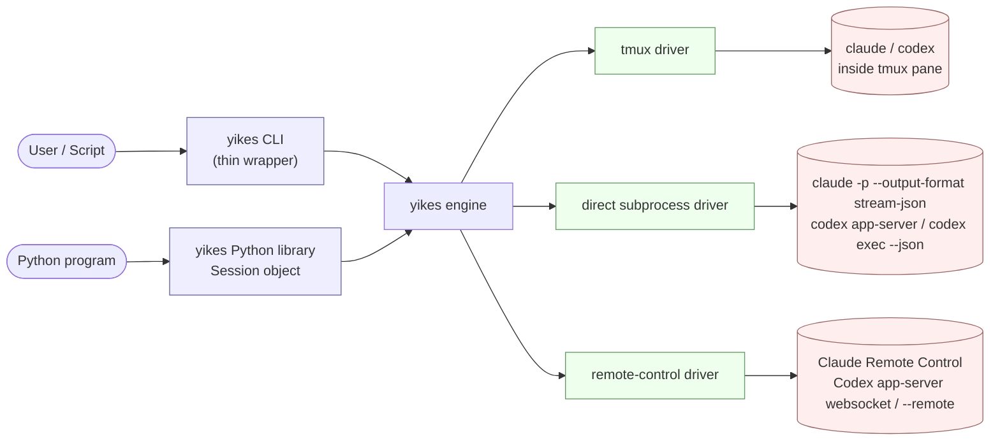

# yikes

A unified driver for **Claude Code** and **Codex CLI** — runs them directly, inside tmux, or through each backend's remote-control surface, exposes them as a Python library and a thin CLI wrapper, and turns their streaming output into a clean event stream.

!!! note "Implementation status"
    The repository now contains the first runnable Python package and Textual terminal app. Some pages still describe the target architecture for the larger session manager; sections marked as roadmap or future design should be read as planned behaviour, not as what the current chatbot slice already implements.

---

## What we're building

Three faces over one engine:

1. **CLI app** — the current implementation provides `yikes` / `yikes tui` for the Textual chatbot and `yikes chat-smoke` for integration smoke tests. The interactive chat app exposes only `direct` and `tmux`, because those can service local prompt/response turns. Remote-control remains a backend/session capability for explicit remote commands and smoke-test slots.
2. **Python library (3.14+)** — `async with Session(...) as s: ...`, iterate streamed events, take snapshots, send keystrokes.
3. **Shared engine** — owns streaming, line-revision tracking, transcript persistence.

Both flavours (Claude Code, Codex) still have six explicit backend/driver test slots: `claude/direct`, `claude/tmux`, `claude/remote-control`, `codex/direct`, `codex/tmux`, and `codex/remote-control`. The interactive chat selector is narrower: it only offers chat-usable drivers (`direct`, `tmux`). Claude remote-control is a human remote UI and is not a local programmatic chat transport.

---

## Why three drivers?

| Driver | When it wins |
|---|---|
| **`direct`** (fast path) | Headless, structured output. `claude -p --output-format stream-json` gives clean token deltas; `codex app-server` gives JSON-RPC with delta events. Lower latency, no screen-scraping, but no access to TUI-only features. |
| **`tmux`** (TUI fallback) | Anything that must drive the local interactive TUI by keystroke: slash commands, prompts, full-screen flows, manual attach, and recovery when native protocols do not expose a feature. |
| **`remote-control`** (native remote/session capability) | Native remote surfaces. Claude Code uses `claude --remote-control` / `/remote-control` for human remote continuation; Codex uses app-server websocket / `codex --remote`. This is not automatically a chat-box transport. It is exposed only where the backend provides a programmatic turn API or where the command is explicitly about native remote session lifecycle. |

The library and CLI accept a `--driver` flag (or `Session(driver="direct"|"tmux"|"remote-control")`). Sensible defaults:

- `direct` for one-shot `-p`-style invocations where we just want clean output.
- `tmux` if the request needs a local interactive TUI or human attach.
- `remote-control` only when requested explicitly for a remote/session lifecycle command or an explicit smoke-test slot; do not expose it as an interactive chat mode unless the backend can service a local prompt/response turn.
- Explicit override always wins.

---

## Goals

- **One Session abstraction** that works for both Claude Code and Codex.
- **Live streaming** of text deltas with low latency (a few ms over native).
- **Line-revision events** so a caller can observe "this line just changed" — the thing that makes spinners and in-place token streams sensible to consume.
- **Snapshots** of the current screen state, cheap to call.
- **Python 3.14+** async-first (TaskGroup, `asyncio.timeout`, pattern matching).
- **CLI is a thin shell** over the library — behaviour must stay consistent across both faces.

## Non-goals (for v1)

- Daemon that pools sessions across users.
- Re-implementing either CLI's prompt parsing.
- Hosting an MCP server ourselves (we *consume* both CLIs; we may expose one later).
- Replacing the native Claude/Codex TUIs. The current Textual app is a yikes control surface over the shared service layer, not a reimplementation of either backend UI.

---

## Why tmux still matters?

Native streaming pipes (`claude -p --output-format stream-json`, `codex exec --json`, `codex app-server`) are objectively better for "give me clean tokens." But the user wants to drive the *interactive* CLIs — approve commands with `y`, paste images, use `/model` or `/compact`, send `Ctrl+C` to cancel a turn. That's a TUI surface, and the cleanest stable way to drive a TUI from outside is to put it in a PTY and control that PTY.

tmux gives us:

- A persistent PTY with a controllable size (output doesn't reflow to 80×24).
- A stable API surface (`send-keys`, `capture-pane`, `paste-buffer`, per-session control mode `-C` taps).
- Sessions survive our wrapper crashing — you can attach with a real terminal and inspect.
- Multiplexing: one tmux server can host many AI sessions on isolated sockets.

tmux is not the semantic control plane when a backend exposes a structured protocol. It is the resilient local TUI fallback and the human-inspection path. Direct subprocess is the fast path for headless work, and remote-control is the native remote/session path when the backend exposes a usable remote surface.

---

## Vocabulary

| Term | Meaning |
|---|---|
| **Backend** | One of `claude` or `codex`. The agent CLI we drive. |
| **Driver** | How we talk to that backend. `direct`, `tmux`, or `remote-control`. |
| **Session** | A single conversation with a backend. Has a stable ID, a transcript, an event stream. |
| **Pane** | The tmux pane that hosts a session when the driver is `tmux`. |
| **Event** | A typed message we surface to the caller (`StreamDelta`, `LineRevised`, `ToolUse`, `ApprovalRequest`, `TurnComplete`, …). |
| **Snapshot** | The current rendered screen text for a session, returned synchronously. |

---

## How to read these docs

- Read [Architecture](architecture.md) first.
- Then either [Claude Code](backends/claude-code.md) or [Codex](backends/codex.md), depending on which CLI you care about.
- [tmux Layer](tmux-layer.md) and [Streaming & Updates](streaming.md) are the implementation core.
- [Python Library](python-library.md) and [CLI Wrapper](cli-wrapper.md) describe the public faces.
- [Roadmap](roadmap.md) has the phased plan and the open questions we need to resolve before writing code.
