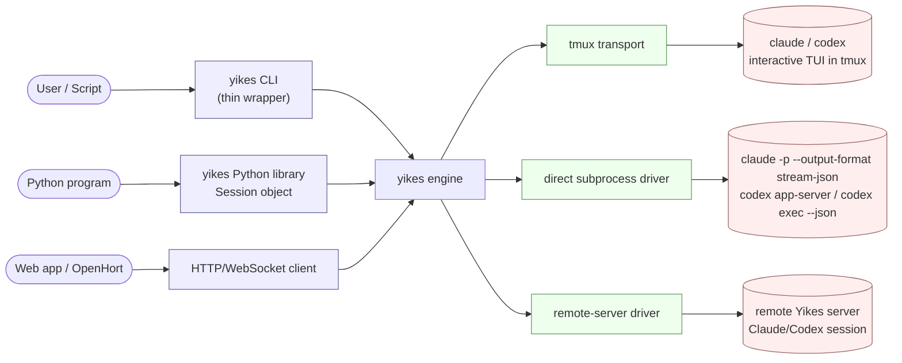

# yikes

A unified runtime for **Claude Code** and **Codex CLI** — runs them directly, inside tmux, and later through a Yikes-owned remote server, exposes them as a Python library and a thin CLI wrapper, and turns their streaming output into a clean event stream.

!!! note "Implementation status"
    The repository now contains the first runnable Python package and Textual terminal app. Some pages still describe the target architecture for the larger session manager; sections marked as roadmap or future design should be read as planned behaviour, not as what the current chatbot slice already implements.

---

## What we're building

Multiple faces over one durable session manager:

1. **CLI app** — the current implementation provides `yikes` / `yikes tui` for the Textual chatbot, `yikes chat-smoke` for integration smoke tests, `yikes sessions` for runtime inventory, and `yikes server` for remote attach.
2. **Python library** — `ChatService.create_session(...)` today, later a durable async `Manager`/`Session` surface.
3. **Web/OpenHort clients** — attach to the same session manager instead of owning Claude/Codex processes.
4. **Shared engine** — owns streaming, line-revision tracking, transcript persistence, policy, and runtime lifecycle.

The active six chatbot test slots are `claude/direct`, `claude/tmux`, `claude/docker`, `codex/direct`, `codex/tmux`, and `codex/docker`. For Docker sessions, tmux is an additional transport flag rather than a mutually exclusive runtime: `driver=docker` plus `tmux_enabled=True` starts the real interactive CLI inside tmux in the container. Remote access is handled by a Yikes-owned `remote-server` control plane rather than Claude Remote Control. The code still has a `remote-control` compatibility enum for Codex's experimental websocket path, but it is not registered as an interactive chat driver.

---

## Why these runtimes?

| Driver | When it wins |
|---|---|
| **`direct`** (fast path) | Headless, structured output. `claude -p --output-format stream-json` gives clean token deltas; `codex app-server` gives JSON-RPC with delta events. Lower latency, no screen-scraping, but no access to TUI-only features. |
| **`tmux`** (TUI transport) | Anything that must drive the local interactive TUI by keystroke: slash commands, prompts, full-screen flows, manual attach, and recovery when native protocols do not expose a feature. This starts `claude` or `codex` interactively; it never uses `claude -p` or `codex exec`. |
| **`docker`** (isolated runtime) | Runs Claude/Codex inside a managed Docker sandbox with persistent container metadata, host MCP proxying through `host.docker.internal`, and explicit credential/env injection. Can also run tmux inside the container for overtake/attach. |
| **`remote-server`** (future remote attach) | A Yikes server owns the backend process and exposes session control over authenticated HTTP/WebSocket. This is the OpenHort integration path. |

The library and CLI accept a driver/runtime flag. Sensible defaults:

- `direct` for one-shot `-p`-style invocations where we just want clean output.
- `tmux` if the request needs a local interactive TUI or human attach.
- `docker` when isolation, persistent sandbox state, or host-MCP bridging into a container is required.
- `docker` plus `--tmux` when isolation and real TUI overtake are both required.
- `remote-server` only when connecting to a configured Yikes server.
- Explicit override always wins.

---

## Goals

- **One Session abstraction** that works for both Claude Code and Codex.
- **Live streaming** of text deltas with low latency (a few ms over native).
- **Line-revision events** so a caller can observe "this line just changed" — the thing that makes spinners and in-place token streams sensible to consume.
- **Snapshots** of the current screen state, cheap to call.
- **Python 3.14+** async-first (TaskGroup, `asyncio.timeout`, pattern matching).
- **CLI is a thin shell** over the library — behaviour must stay consistent across both faces.

## Non-goals (for v1)

- Multi-user hosted SaaS. A local/server session manager is in scope; shared public hosting is not.
- Re-implementing either CLI's prompt parsing.
- Hosting an MCP server ourselves (we *consume* both CLIs; we may expose one later).
- Replacing the native Claude/Codex TUIs. The current Textual app is a yikes control surface over the shared service layer, not a reimplementation of either backend UI.

---

## Why tmux still matters?

Native streaming pipes (`claude -p --output-format stream-json`, `codex exec --json`, `codex app-server`) are objectively better for "give me clean tokens." But the user wants to drive the *interactive* CLIs — approve commands with `y`, paste images, use `/model` or `/compact`, send `Ctrl+C` to cancel a turn. That's a TUI surface, and the cleanest stable way to drive a TUI from outside is to put it in a PTY and control that PTY.

tmux gives us:

- A persistent PTY with a controllable size (output doesn't reflow to 80×24).
- A stable API surface (`send-keys`, `capture-pane`, `paste-buffer`, per-session control mode `-C` taps).
- Sessions survive our wrapper crashing — you can attach with a real terminal and inspect.
- Multiplexing: one tmux server can host many AI sessions on isolated sockets.

tmux is not the semantic control plane when a backend exposes a structured protocol. It is the resilient TUI transport and the human-inspection path. It can be used locally or inside Docker. Direct subprocess is the fast path for headless work, and remote-server is the future multi-client attach path.

If no `cwd` is passed for a tmux-backed session, Yikes allocates a random workspace where the session starts. Local tmux sessions get a temporary host directory. Docker+tmux sessions get a random directory inside the container volume rather than silently mounting the caller's host cwd. Generated workspaces may have their first-run trust prompt confirmed automatically; explicit directories are left for the user to approve or overtake manually.

---

## Vocabulary

| Term | Meaning |
|---|---|
| **Backend** | One of `claude` or `codex`. The agent CLI we drive. |
| **Runtime / Driver** | How we talk to that backend. Current: `direct`, `tmux`, `docker`; future/remote: `remote-server`. tmux is also a transport flag for Docker sessions. |
| **Session** | A single conversation with a backend. Has a stable ID, a transcript, an event stream. |
| **Pane** | The tmux pane that hosts a session when the driver is `tmux`. |
| **Event** | A typed message we surface to the caller (`StreamDelta`, `LineRevised`, `ToolUse`, `ApprovalRequest`, `TurnComplete`, …). |
| **Snapshot** | The current rendered screen text for a session, returned synchronously. |

---

## How to read these docs

- Read [Architecture](architecture.md) first.
- Then either [Claude Code](backends/claude-code.md) or [Codex](backends/codex.md), depending on which CLI you care about.
- [tmux Layer](tmux-layer.md) and [Streaming & Updates](streaming.md) are the implementation core.
- [Python Library](python-library.md) and [CLI Wrapper](cli-wrapper.md) describe the public faces.
- [Embedding](embedding.md) covers Python/web embedding, including iframe-plus-chat editor use cases.
- [OpenHort Parity](openhort-parity.md) tracks what Yikes must own before OpenHort removes duplicated functionality.
- [Roadmap](roadmap.md) has the phased plan and the open questions we need to resolve before writing code.
