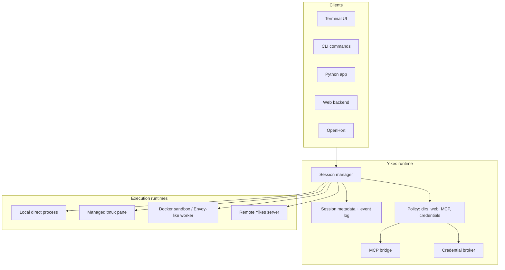

# OpenHort Parity Contract

Yikes is intended to become the agent/session runtime used by OpenHort. OpenHort should be able to remove its duplicated Claude/Codex control code later without losing central functionality.

This page is the migration contract. If a feature exists in OpenHort and belongs to agent execution, sessions, MCP routing, credentials, or remote attach, Yikes must either own it or expose a clean integration point.

## Current Implementation Status

| Area | Status in Yikes |
|---|---|
| Embeddable Python chat session | implemented: `ChatService.create_session()` |
| Durable session metadata | implemented: `DurableSessionManager` stores metadata under `~/.yikes/sessions` |
| Docker sandbox metadata/lifecycle wrapper | implemented: `SandboxManager` / `SandboxSession`; default image build is checked in |
| Sandbox cleanup policies | implemented: expired/count/space reaper helpers |
| Bearer-token storage | implemented: `TokenStore` with hashed tokens and temporary/permanent token support |
| MCP bridge/proxy | partially implemented: config/filtering and stdio-to-SSE proxy primitives |
| Credential broker/injection | partially implemented: explicit grants, env/static/callback/Claude providers, secret-env building |
| Remote HTTP/WebSocket server | partially implemented: WebSocket command handler/server wrapper |
| Event streaming/replay server | partially implemented: append-only event log and replay by sequence |
| Overtake/attach | implemented for local tmux and Docker+tmux via `SessionLifecycle.attach_command()` / `yikes attach` |

## Ownership Split

| Capability | Yikes owns | OpenHort keeps |
|---|---|---|
| Claude/Codex process control | yes | no |
| Direct prompt/stream protocols | yes | no |
| tmux/PTY lifecycle and attach | yes | no |
| Durable agent sessions | yes | consumes |
| Docker/isolated runtime sessions | yes, as runtime backend | may provide host/container inventory |
| MCP attachment and policy | yes | may provide MCP servers/tools |
| Credential grants to runtimes | yes | may provide credential sources |
| Web search enable/disable | yes | UI may toggle |
| Read/write directory grants | yes | UI may configure |
| Remote server attach | yes | may host/proxy Yikes |
| OpenHort viewer, cards, horts, devices | no | yes |

## Required Yikes Runtime Concepts

Yikes must not model execution as "the CLI process owns the session". The durable owner is a session manager, and frontends attach to it.

The future daemon can be named `yikesd`, but the important part is the boundary:

- `close()` / frontend disconnect detaches only.
- `kill()` destroys the running backend process.
- `destroy()` removes durable session state, logs, volumes, and runtime metadata.
- `list()` reconciles known metadata with live tmux panes, Docker containers, and remote runtimes.

## OpenHort Features Yikes Must Cover

### Durable Sessions

Yikes needs first-class session metadata under `~/.yikes/`, independent from the TUI process:

- stable Yikes session ID
- backend and runtime
- native Claude/Codex session/thread ID
- cwd, model, complexity
- readable and writable directory grants
- web-search setting
- MCP registry snapshot
- credential grant names, never credential values
- attach endpoints, tmux socket/pane, container ID, or remote server URL
- event log and transcript pointers

This lets OpenHort restart, reconnect, and list sessions without depending on a still-running UI process.

### Runtime Backends

The old flat `driver` vocabulary is not enough for OpenHort parity. Yikes needs runtime backends:

| Runtime | Purpose |
|---|---|
| `direct` | Structured local protocols: Claude headless, Codex app-server/exec |
| `tmux` | Interactive TUI transport and human attach. Local tmux starts the real CLI directly; it never uses `claude -p` or `codex exec`. |
| `docker` | Isolated execution with persistent workspace, resource limits, and MCP bridge. Docker can also enable tmux inside the container for real overtake. |
| `remote-server` | Attach to a Yikes server over HTTP/WebSocket with bearer-token auth |

Claude Remote Control is intentionally not a Yikes chat runtime. It is a Claude human remote UI. If we expose it later, it should be a lifecycle/status integration, not a prompt/response transport.

tmux and Docker are separate axes. OpenHort must be able to request `docker + tmux` when it wants isolation and later human takeover of the same in-container TUI session.

### MCP Bridge

Yikes must expose one MCP model to all frontends:

- register host stdio MCPs
- register HTTP/SSE MCPs
- register in-memory Python tools
- expose selected tools into Docker/remote runtimes
- for Docker, host stdio MCPs are proxied as SSE endpoints and containers reach them through `host.docker.internal`
- filter `tools/list` for allow-lists
- block `tools/call` for denied tools
- audit tool calls

The UI must continue to ask registries for valid options. Commands and suggestions must not hardcode models, MCP names, or runtime choices.

### Credentials

Yikes must have a credential broker before OpenHort removes its own Claude/Codex plumbing:

- credentials flow from parent host/server into child runtime
- grants are explicit per session
- session metadata stores grant names only
- transcripts and command lines never contain secret values
- Docker/runtime injection is ephemeral
- bearer tokens for remote attach are hashed at rest and revocable
- Claude Docker auth can use env/API-key/OAuth-token injection; Codex Docker auth is copied from `~/.codex/auth.json` into the container's temporary HOME with `0600` permissions.

The initial implementation can support env/keychain sources, but the API shape must already support explicit grants and later rotation.

### Directory and Web Policies

The existing `AgentSettings` object is the right starting point, but enforcement must move below the prompt:

- read/write roots become runtime policy
- `read`, `write`, and future `write-only` grants are separate
- Docker runtimes mount the working directory and configured read/write roots explicitly. Read roots are mounted read-only; write roots are mounted read-write.
- When no directory is passed for a tmux-backed session, Yikes creates a random workspace where the session starts. Local tmux uses a host temp directory. Docker+tmux uses a container directory in the Docker volume and does not mount the host cwd.
- MCP filesystem tools receive the same grants
- web search can be enabled/disabled per session and surfaced to adapters

Prompt text is only a hint. The runtime/MCP bridge must enforce the rule.

## OpenHort Migration Checklist

- Yikes exposes a Python `Session` facade for embedded apps.
- Yikes exposes a long-lived manager API for `spawn`, `list`, `get`, `attach`, `kill`, `destroy`.
- Yikes can run sessions without the TUI attached.
- Yikes can enumerate durable tmux/remote metadata and managed Docker runtimes after crashes via `SessionInventory` and `yikes sessions`.
- Yikes can close one session or close matching sessions in bulk through `SessionLifecycle`, `yikes close`, `yikes close-all`, slash commands, and the interactive UI.
- Yikes can overtake local tmux and Docker+tmux sessions with `yikes attach`; Docker attach shells into the container and attaches to the in-container tmux socket.
- Yikes can bridge host stdio MCPs into Docker runtimes through the SSE proxy path. In-memory MCP tools are still a target capability.
- Yikes can run with explicit read/write directory grants.
- Yikes can receive remote client connections with scoped bearer tokens.
- OpenHort uses Yikes as a normal Python package or remote Yikes server instead of owning Claude/Codex process code.
