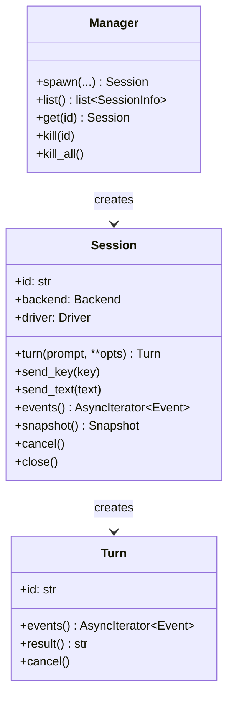

# Python Library

The library is the canonical face. The CLI is a thin shell over it (so behaviour stays consistent). Async-first, Python **3.14+**, type-checked end-to-end.

!!! note "Python 3.14 features we lean on"
    `TaskGroup`, `asyncio.timeout()`, structural pattern matching, PEP 695 type aliases, `Self` return types, frozen dataclasses, `typing.override`.

## Surface at a glance

Current synchronous chatbot slice:

```python
from pathlib import Path
from yikes import AgentSettings, Backend, ChatService, Driver, McpServer

settings = AgentSettings(
    web_search_enabled=True,
    read_roots=(Path("docs"),),
    write_roots=(Path("tmp"),),
    mcp_servers=(McpServer("fs", "python", ("-m", "server")),),
)
conversation = ChatService().create_conversation(
    Backend.CLAUDE,
    Driver.DIRECT,
    settings=settings,
)
answer = conversation.ask("Hello, my name is Michael. How are you doing?")
```

Larger target async session surface:

```python
import asyncio
from yikes import Session, Backend, Driver, events

async def main():
    async with Session(backend=Backend.CLAUDE, driver=Driver.TMUX) as s:
        async with s.turn("Refactor src/auth.py to use httpx") as turn:
            async for ev in turn.events():
                match ev:
                    case events.StreamDelta(text=t):
                        print(t, end="", flush=True)
                    case events.ApprovalRequest() as req:
                        await req.approve()
                    case events.TurnComplete(usage=u):
                        print(f"\ndone — {u.input_tokens}/{u.output_tokens} tokens")

asyncio.run(main())
```

The whole library is built around three concepts:



## Top-level API

### `yikes.Manager`

The session-lifecycle entry point. Equivalent of `tmux ls`/`kill`/`kill-server` for our domain.

```python
class Manager:
    def __init__(
        self,
        *,
        socket_path: Path | None = Path.home() / ".yikes" / "tmux" / "default.sock",
        config_dir: Path = Path.home() / ".yikes",
    ) -> None: ...

    async def spawn(
        self,
        backend: Backend,
        *,
        driver: Driver = Driver.AUTO,
        name: str | None = None,
        cwd: Path | None = None,
        env: dict[str, str] | None = None,
        cols: int = 200,
        rows: int = 50,
        resume: str | None = None,         # native session ID to resume
        model: str | None = None,
        system_prompt: str | None = None,
        append_system_prompt: str | None = None,
        allowed_tools: list[str] | None = None,
        disallowed_tools: list[str] | None = None,
        permission_mode: PermissionMode = PermissionMode.DEFAULT,
        max_turns: int | None = None,
        max_budget_usd: float | None = None,
        remote: str | None = None,          # remote name or endpoint for Driver.REMOTE_CONTROL
        extra_args: list[str] | None = None,   # passed through verbatim
    ) -> Session: ...

    async def list(self) -> list[SessionInfo]: ...
    async def get(self, session_id: str) -> Session | None: ...
    async def kill(self, session_id: str) -> None: ...
    async def kill_all(self) -> None: ...
    async def attach_command(self, session_id: str) -> list[str]:
        """Returns argv for tmux attach or native remote attach."""
        ...
```

`SessionInfo` (lightweight, for listing without instantiating):

```python
@dataclass(frozen=True)
class SessionInfo:
    id: str
    name: str
    backend: Backend
    driver: Driver
    pid: int | None
    cwd: Path
    started_at: datetime
    state: SessionState        # SPAWNING | READY | STREAMING | APPROVAL | PAUSED | DEAD
    native_session_id: str | None
    model: str | None
    cost_usd: float
    turns: int
    remote_url: str | None
    remote_endpoint: str | None
```

### `yikes.Session`

A single conversation. Created via `Manager.spawn()` or `Manager.get()`. Implements both async context manager and explicit `close()`.

```python
class Session:
    id: str
    info: SessionInfo                   # snapshot at last query

    async def __aenter__(self) -> Self: ...
    async def __aexit__(self, *exc) -> None: ...   # closes; does NOT kill by default

    # --- Turns ---
    def turn(
        self,
        prompt: str | Iterable[Part],
        *,
        timeout: float | None = None,
    ) -> Turn:
        """Open a turn. Async context manager."""
        ...

    async def prompt(self, text: str | Iterable[Part], **opts) -> str:
        """Convenience: open turn, collect full assistant text, return it."""
        ...

    # --- Low-level input (advanced, mostly for TUI mode) ---
    async def send_text(self, text: str, *, bracketed_paste: bool = True) -> None: ...
    async def send_key(self, key: str) -> None: ...
    async def send_slash(self, command: str, args: str = "") -> None: ...
    async def cancel(self) -> None: ...

    # --- Output / observation ---
    def events(self, *, only: tuple[type[Event], ...] | None = None
              ) -> AsyncIterator[Event]: ...
    async def snapshot(self) -> Snapshot: ...

    # --- Lifecycle ---
    async def kill(self) -> None:
        """Terminate the underlying process; transcript preserved."""
        ...
    async def close(self) -> None:
        """Detach from session; process keeps running. Use kill() to terminate."""
        ...
```

### `yikes.Turn`

A single back-and-forth. Created via `session.turn(...)`. Owns its event stream and result.

```python
class Turn:
    id: str

    async def __aenter__(self) -> Self: ...
    async def __aexit__(self, *exc) -> None: ...    # finalises the turn

    def events(self) -> AsyncIterator[Event]: ...   # only this turn's events
    async def result(self) -> str: ...              # waits for completion
    async def usage(self) -> Usage | None: ...
    async def cancel(self) -> None: ...
```

`Turn.events()` is a *scoped* view — it stops at `TurnComplete`. `Session.events()` keeps yielding across turns.

## Event types

Defined in `yikes.events`:

| Event | Fields | When |
|---|---|---|
| `SessionReady` | `cwd`, `model`, `native_id` | After spawn, prompt is ready |
| `TurnStart` | `turn_id`, `user_text` | We've submitted a prompt |
| `StreamDelta` | `text`, `block_id`, `role` | Streamed text from assistant or reasoning |
| `StreamDeltaEnd` | `block_id` | Block finished |
| `LineRevised` | `line_no`, `new_text`, `prev_text` | TUI redraw observed |
| `ToolUse` | `tool`, `input`, `tool_use_id` | Tool/command invoked |
| `ToolResult` | `tool_use_id`, `output`, `is_error` | Tool finished |
| `ApprovalRequest` | `prompt`, `options`, `request_id` | TUI/app-server wants permission |
| `Notice` | `level`, `message` | Adapter / driver advisory |
| `TurnComplete` | `stop_reason`, `usage` | Turn ended cleanly |
| `TurnFailed` | `reason`, `recoverable` | Turn errored |
| `Stopped` | `reason`, `exit_code` | Session-level termination |

All events are frozen dataclasses, share a base `Event(session_id, seq, ts)`.

## Approval flow

`ApprovalRequest` is special — the engine *waits* for a response. The caller has three options:

```python
async for ev in turn.events():
    match ev:
        case events.ApprovalRequest() as req:
            await req.approve()                 # most common
            # or:
            await req.deny(reason="not now")
            # or:
            await req.approve(remember=True)    # if backend supports "don't ask again"
```

Or set a default policy at session level:

```python
session = await mgr.spawn(
    Backend.CLAUDE,
    permission_mode=PermissionMode.AUTO_ACCEPT_READ_ONLY,
)
```

`PermissionMode` enum:

- `DEFAULT` — ask every time.
- `AUTO_ACCEPT_READ_ONLY` — auto-approve Read/Glob/Grep; ask for others.
- `AUTO_ACCEPT_ALL` — translates to `--permission-mode acceptEdits` for Claude, `--ask-for-approval never` for Codex.
- `PLAN` — Claude `--permission-mode plan` (read-only analysis).
- `BYPASS` — Claude `bypassPermissions` / Codex `--yolo`. **Sandbox only.**

## "I just want the answer" — sync-style ergonomics

For scripts that don't want to subscribe to events:

```python
from yikes import quick

text = await quick(Backend.CLAUDE, "explain @src/auth.py")
```

`quick()` opens a session in `direct` driver, runs one turn, returns the assembled text, closes. Equivalent to `claude -p` but unified across backends.

```python
text, usage = await quick(Backend.CODEX, "summarise diff", return_usage=True)
```

## Multi-line prompts, parts, attachments

A prompt is a `str` or an iterable of `Part`:

```python
from yikes import Part

await session.turn([
    Part.text("Review this image and the file:"),
    Part.image("/path/to/screenshot.png"),
    Part.file_ref("src/auth.py"),
    Part.text("Focus on the token validation."),
])
```

- `Part.text(str)` — raw text.
- `Part.image(path)` — adds native image input in direct mode, attaches via paste-buffer or `@path` in tmux mode, and in remote-control mode must resolve on the host where the backend process runs.
- `Part.file_ref(path)` — translates to `@path` for both backends, after validating that the path exists on the backend host.
- `Part.from_stdin()` — for piped input.

For remote-control sessions, local paths are not assumed to exist remotely. The adapter either copies the file into the remote workspace through an explicit transfer hook or rejects the part with `AttachmentUnavailable`.

## Configuration

```python
from yikes import settings

settings.tmux.socket_path = Path.home() / ".yikes" / "tmux" / "prod.sock"
settings.tmux.pane_width = 240
settings.tmux.pane_height = 60
settings.tmux.frame_sync = True
settings.tmux.coalesce_ms = 80

settings.remote_control.default_host = "127.0.0.1"
settings.remote_control.require_auth_for_non_loopback = True

settings.transcripts.dir = Path.home() / ".yikes" / "sessions"
settings.transcripts.persist = True

settings.defaults.driver = Driver.AUTO
settings.defaults.permission_mode = PermissionMode.DEFAULT
```

Loaded from `~/.config/yikes/config.toml` if present; programmatic overrides win.

## Errors

```python
class YikesError(Exception): ...
class BackendUnavailable(YikesError): ...     # claude / codex binary missing
class TmuxUnavailable(YikesError): ...
class SessionNotFound(YikesError): ...
class ApprovalTimeout(YikesError): ...
class TurnFailed(YikesError):
    reason: str
class ProtocolError(YikesError): ...           # JSON-RPC / NDJSON parse error
```

## Concurrency

Multiple sessions can run in parallel — each has its own pane / subprocess. A `Manager` is fine to share; `Session` is **not** re-entrant (one turn at a time per session, just like the real CLIs).

```python
async with asyncio.TaskGroup() as tg:
    s1 = await mgr.spawn(Backend.CLAUDE)
    s2 = await mgr.spawn(Backend.CODEX)
    tg.create_task(s1.prompt("refactor auth"))
    tg.create_task(s2.prompt("write tests for auth"))
```

## Reconnect / takeover

A session created in one process can be picked up by another:

```python
# process A
s = await mgr.spawn(Backend.CLAUDE, name="long-task")
await s.close()    # detach, keep running

# process B (later)
s = await mgr.get("long-task")            # by name
async for ev in s.events():               # picks up where A left off
    ...
```

This works because the underlying tmux pane, direct app-server subprocess, or remote-control endpoint is still alive. The transcript is replayed from JSONL up to the last seen `seq`, then live events continue.

## Type discipline

The library is fully typed. We use:

- `from __future__ import annotations` everywhere.
- `typing.Literal` for option enums where appropriate.
- `Protocol` for the internal `Driver` and `BackendAdapter` interfaces.
- `pydantic` is **not** a dependency for the public API — plain dataclasses + `mashumaro` (or hand-rolled `__init_subclass__`) for transcript (de)serialisation.

## Library layout

```
yikes/
├── __init__.py            # re-exports: Session, Manager, Backend, Driver, events, Part, quick, settings
├── manager.py
├── session.py
├── turn.py
├── events.py
├── settings.py
├── errors.py
├── engine/
│   ├── bus.py
│   ├── transcript.py
│   ├── snapshot.py
│   └── vt/
│       ├── emulator.py     # pyte wrapper
│       ├── differ.py       # line revision
│       └── blocks.py       # block tracker
├── drivers/
│   ├── base.py
│   ├── tmux/
│   │   ├── driver.py
│   │   ├── control.py      # -C subprocess
│   │   ├── commands.py     # libtmux wrappers
│   │   └── isolation.py    # socket / config setup
│   ├── direct/
│       ├── driver.py
│       └── pty.py
│   └── remote_control/
│       ├── driver.py
│       ├── claude.py
│       └── codex_ws.py
├── backends/
│   ├── base.py
│   ├── claude/
│   │   ├── adapter.py
│   │   ├── argv.py
│   │   ├── stream_json.py  # NDJSON parser
│   │   ├── tui_keys.py     # keystroke vocabulary
│   │   └── approval.py
│   └── codex/
│       ├── adapter.py
│       ├── app_server.py   # JSON-RPC client
│       ├── exec_json.py    # NDJSON parser
│       ├── tui_keys.py
│       └── _generated/     # types from codex app-server generate-json-schema
└── cli/
    └── __main__.py
```
