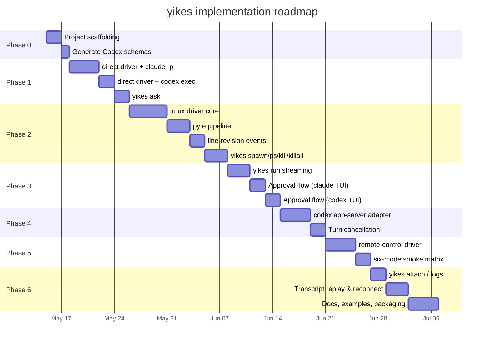

# Roadmap

A phased plan so the first useful version ships fast, and each phase has a clear acceptance test.

## Phasing



## Phase 0 — Scaffolding (≈3 days)

**Goal:** Project skeleton, dev loop, type-check + test gates.

- `pyproject.toml` (PEP 621, Python ≥3.14, `uv` for dep mgmt).
- `mkdocs.yml` already in place; CI builds and previews.
- `ruff` + `pyright` strict mode.
- `pytest` with `pytest-asyncio` in auto mode.
- Codegen step: `codex app-server generate-json-schema` → checked-in `_generated/` dataclasses.
- A minimal smoke test that imports `yikes` and runs no real backends.

**Acceptance:** `make test`, `make typecheck`, `make docs` all pass on an empty repo.

## Phase 1 — Direct driver, both backends (≈8 days)

**Goal:** `yikes ask` works end-to-end for both Claude and Codex, headless.

- `yikes.drivers.direct` — PTY-based subprocess driver.
- `yikes.backends.claude` — argv builder + NDJSON parser for `claude -p --output-format stream-json --verbose --include-partial-messages`.
- `yikes.backends.codex` — argv builder + NDJSON parser for `codex exec --json`.
- Engine event bus with `StreamDelta`, `ToolUse`, `TurnComplete`.
- CLI: `yikes ask "<prompt>"`, `yikes -b codex ask "<prompt>"`.
- Smoke tests against real binaries (gated by env var so CI without API keys still runs unit tests).

**Acceptance:**

```bash
echo "two plus two" | yikes ask
echo "two plus two" | yikes -b codex ask
yikes ask --json "..." | jq 'select(.type=="turn_complete")'
```

## Phase 2 — tmux driver + session management (≈13 days)

**Goal:** Sessions you can spawn, list, kill, killall, attach to. No streaming yet — that's Phase 3.

- `yikes.drivers.tmux` — socket isolation, `new-session`, `kill-session`, `kill-server`, `capture-pane`, `send-keys`, `paste-buffer`.
- `TmuxControl` — one `tmux -C attach -t <session-id>` stream tap per observed session; notification reader; pause/continue support.
- `yikes.engine.vt` — pyte wrapper, dirty-line differ, block tracker.
- `LineRevised` and `StreamDelta` events from the pyte pipeline.
- CLI: `yikes spawn`, `yikes ps`, `yikes kill`, `yikes killall`, `yikes attach`.

**Acceptance:**

```bash
yikes spawn                  # outputs ID
yikes -b codex spawn --name x
yikes ps                     # shows both
yikes attach <id>            # opens the TUI in user's terminal
yikes kill <id>
yikes killall
yikes ps                     # empty
```

Smoke test: spawn, take snapshot, verify prompt sentinel is present, kill.

## Phase 3 — Live streaming via tmux + approval flow (≈7 days)

**Goal:** `yikes run` streams from a tmux-hosted TUI session; approvals work.

- `yikes run "<prompt>"` opens turn, streams events.
- `ApprovalRequest` detection for Claude TUI (modal layout matcher) and Codex TUI (BottomPane).
- Approval response API in `Session`/`Turn`.
- Interactive y/n on stdin for `yikes run` when on a TTY.
- DECSET 2026 frame sync; coalesce window.

**Acceptance:**

```bash
yikes run "create a file called test.txt with 'hello'"
# stream of events; "Approve Bash?" prompt; type 'y'; turn completes
```

Replay-test corpus: recorded byte streams from real Claude/Codex TUIs covering pure streams, approvals, slash commands, cancellations.

## Phase 4 — Codex app-server direct adapter (≈6 days)

**Goal:** Codex's structured programmatic interface is wired up; we prefer it over `exec --json` for direct ops.

- JSON-RPC client over stdio.
- `initialize` + `initialized`, `thread/start`, `thread/resume`, `thread/list`, `thread/fork`, `turn/start`, `turn/steer`, `turn/interrupt`.
- Notification handling for `item/agentMessage/delta`, `item/reasoning/delta`, `item/completed`, `turn/completed`, `turn/failed`.
- Server request handling for `item/commandExecution/requestApproval`, `item/fileChange/requestApproval`, and `serverRequest/resolved`.
- `Session.cancel()` and `Turn.cancel()` wired to `turn/interrupt`.
- `yikes ps` includes Codex sessions via `thread/list`.

**Acceptance:**

```bash
yikes -b codex spawn --use-app-server
yikes -b codex run -s <id> "long task"
# in another shell:
yikes -b codex cancel <id>      # uses turn/interrupt
```

## Phase 5 — Remote-control driver + six-mode smoke matrix (≈6 days)

**Goal:** `remote-control` is first-class for both backends, and every backend/driver combination has a smoke test.

- `yikes.drivers.remote_control` shared interface and state model.
- Claude Remote Control adapter: `claude --remote-control [name]`, status parsing, local-process lifecycle, remote metadata.
- Codex websocket adapter: `codex app-server --listen ws://...`, loopback default, websocket auth requirements for non-loopback, direct JSON-RPC over websocket.
- `yikes remote` command.
- Attachment/path validation for remote hosts.
- Six-mode smoke matrix:
  - `claude/direct`
  - `claude/tmux`
  - `claude/remote-control`
  - `codex/direct`
  - `codex/tmux`
  - `codex/remote-control`

**Acceptance:**

```bash
yikes -b claude -d direct ask "ping"
yikes -b claude -d tmux run "ping"
yikes -b claude -d remote-control remote --name smoke
yikes -b codex -d direct ask "ping"
yikes -b codex -d tmux run "ping"
yikes -b codex -d remote-control remote --listen 127.0.0.1:0
```

## Phase 6 — Attach, logs, replay, packaging (≈9 days)

**Goal:** Production polish.

- `yikes logs <id>` with `--follow`, `--since`, `--format`.
- Transcript replay: a second process attaching to a running session sees backfilled history then live events.
- `Manager.get(name_or_id)` works across process boundaries (state in `~/.yikes/`).
- Distribution: `pip install yikes`; binary entry point `yikes`.
- Docs site published.
- Example notebooks: parallel sessions, cost tracking, structured-output extraction.

**Acceptance:** Fresh checkout → `pip install -e .` → `yikes ask hello` works.

## Beyond v1

Not in v1, but worth tracking:

- **Web UI / IDE plugin** — the engine's event bus makes a WebSocket bridge trivial.
- **MCP server face** — expose `yikes.spawn`/`yikes.list`/`yikes.cancel` as MCP tools so the AI can drive itself recursively (carefully).
- **Multi-machine sessions** — remote-control paths and Codex websocket app-server are preferred. tmux over SSH remains an escape hatch, but we do not expose tmux sockets over the network.
- **Recording & playback** — capture the full byte stream as asciinema-style typescript for later replay.
- **Cost-aware scheduling** — pick the cheapest backend that can handle a task.
- **Cross-backend routing** — same prompt, two backends, compare results.

## Open questions

These need a decision before the corresponding phase starts.

### Q1. Auto driver selection — heuristic or explicit?
**Recommendation:** heuristic by command (`ask`→`direct`, `run`/`shell`→`tmux`, `spawn`→`tmux`, `remote`→`remote-control`); explicit `--driver` always wins. Do not silently select `remote-control` for normal local work.
**Decision needed by:** Phase 1.

### Q2. Codex app-server vs exec --json — which is the default `direct` for Codex?
**Recommendation:** `app-server` for everything except `yikes ask` (where `exec --json` is fine because there's no need for cancellation). Reassess if app-server proves flaky for short tasks.
**Decision needed by:** Phase 4.

### Q3. Pane size — fixed or per-spawn?
**Recommendation:** Default 200×50, override per `spawn` via `--cols`/`--rows`. Lock with `resize-window -A` so attaching clients don't reflow.
**Decision needed by:** Phase 2.

### Q4. Permission policy default for `yikes run`?
**Recommendation:** `DEFAULT` (ask). For CI/scripts, callers pass `--auto-approve read-only` or `--auto-approve all`.
**Decision needed by:** Phase 3.

### Q5. Should `yikes close` (Python) kill the tmux pane?
**Recommendation:** No. `close()` detaches; `kill()` terminates. Matches the user's mental model of tmux.
**Decision needed by:** Phase 1.

### Q6. Transcript on by default?
**Recommendation:** Yes, at `~/.yikes/sessions/`. Override via settings.
**Decision needed by:** Phase 5.

### Q7. Bundle a tmux binary, or require it on PATH?
**Recommendation:** Require on PATH. Document the install path per OS. Bundling is hostile to system admins.
**Decision needed by:** Phase 0 (affects packaging).

### Q8. Slash-command parity — translate `/model x` cross-backend, or pass through?
**Recommendation:** Pass through. Each TUI has its own slash vocabulary; trying to unify creates worse confusion.
**Decision needed by:** Phase 3.

### Q9. Stdin handling for `yikes run`?
**Recommendation:** If stdin is a TTY, read approval responses from it; if it's piped, treat the pipe as part of the prompt and require approvals to be set via flags.
**Decision needed by:** Phase 3.

### Q10. What's the minimum tmux version we support?
**Recommendation:** 3.4+ for DECSET 2026 pass-through and `terminal-features ',xterm*:sync'`. Older versions degrade gracefully to quiet-period coalescing.
**Decision needed by:** Phase 2.

### Q11. How do we handle backend version drift?
Both Claude Code and Codex change their event schemas and TUI layouts between releases. Claude Code auto-updates silently by default; Codex prompts to update. Either can break our `stream-json` parser, approval-prompt detection, or `app-server` notification handling overnight.

**Recommendation:**

- **Disable Claude Code's auto-updater for yikes-spawned processes** by injecting `DISABLE_AUTOUPDATER=1` into the child env. User's interactive `claude` outside yikes is unaffected.
- **Generate Codex types at build time** from `codex app-server generate-json-schema`; check the snapshot into `_generated/`.
- **Version probe on spawn** for both backends. Emit a `Notice` warning when the installed version is newer than the highest fixture set we ship.
- **Replay fixtures in CI** per backend per version. Adding support for a new version means recording fresh fixtures.
- **Pin exact versions in our own CI** so test breakage is observed in our CI, not in user installs.

**Decision needed by:** Phase 1 (affects how the direct driver builds env for child processes).

### Q12. What is the remote-control security baseline?
Remote-control introduces remote endpoints and potentially bearer tokens. The default must not create a network listener that another machine can use without explicit opt-in.

**Recommendation:**

- Claude Remote Control uses Claude Code's native outbound service path; yikes stores only metadata and never the user's remote auth material.
- Codex websocket app-server binds to loopback by default. Non-loopback requires explicit `--remote-bind`, explicit websocket auth mode, and token material passed by file/env, never raw CLI args.
- Remote-control transcripts redact URLs/tokens and store endpoint labels, not secrets.
- Local file/image attachments are validated against the backend host; if a path is local-only, reject unless a configured transfer hook copies it first.

**Decision needed by:** Phase 5.

## What to read next

If you want to start implementing:

1. Read [Architecture](architecture.md) to understand the layering.
2. Read [tmux Layer](tmux-layer.md) and [Streaming & Updates](streaming.md) — that's the hard part.
3. Read the backend page you're starting with: [Claude Code](backends/claude-code.md) or [Codex](backends/codex.md).
4. Read [Python Library](python-library.md) for the public API contract you're implementing.
5. Read [CLI Wrapper](cli-wrapper.md) for the surface that wraps it.

If you want to push back on the design:

- Open questions above are the right place.
- Anything labelled **Recommendation** is a starting position, not a fixed decision.
