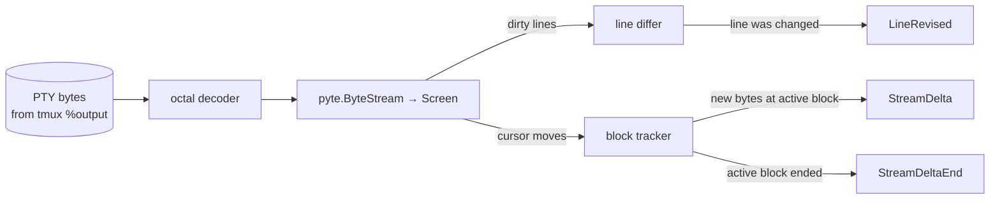
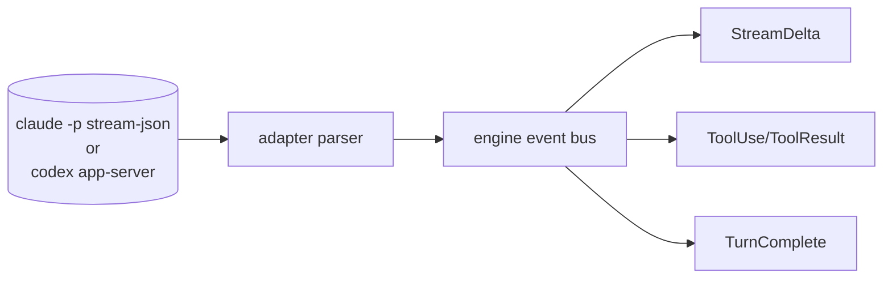
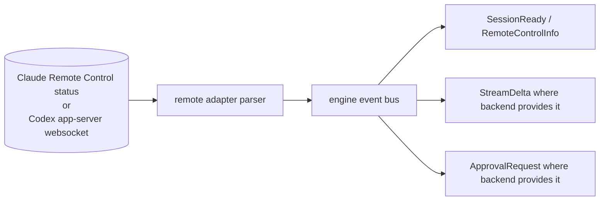
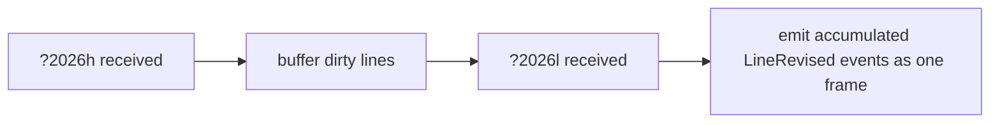

# Streaming & Updates

The single most distinctive feature: callers can observe both *streamed tokens* (append) and *line revisions* (overwrite) without having to parse ANSI themselves.

## Why this is hard

TUI apps write to the terminal in two distinct ways:

1. **Append**: new content at the cursor. Easy — every byte is a delta.
2. **In-place update**: cursor-move + erase-line + new content. The line you saw 50 ms ago has been *replaced*. If you naively `tail -f` the byte stream, you'd see all the intermediate versions and not know which one is current.

Claude Code's `--output-format stream-json` solves this for itself — it emits structured deltas with stable block IDs. But the TUI mode (and Codex's TUI) does not. So our pipeline has to:

- Consume raw bytes from a PTY (via one tmux control-mode `%output` tap per observed pane).
- Maintain an in-memory model of the screen (pyte).
- Emit two kinds of events: streamed deltas, and line revisions.

## Pipeline (tmux driver)



### pyte usage

```python
import pyte
screen = pyte.Screen(cols=200, rows=50)
stream = pyte.ByteStream(screen)

# in the reader loop
stream.feed(chunk)
dirty = sorted(screen.dirty)
for row in dirty:
    new_text = screen.display[row]
    if new_text != prev_snapshot[row]:
        await emit(LineRevised(line_no=row, new_text=new_text,
                                prev_text=prev_snapshot[row]))
        prev_snapshot[row] = new_text
screen.dirty.clear()
```

`screen.display` is a list of strings, one per row, already with ANSI stripped and trailing spaces handled. `screen.dirty` is the set of rows touched since the last call.

### Block tracking (for `StreamDelta`)

A "block" is a contiguous run of text written at the cursor without significant cursor jumps. The tracker maintains:

- `active_block_id`: a UUID generated when the cursor enters a new visual region.
- `active_block_text`: accumulated text.

Rules:

- Cursor moved by `+1` in x (normal write) → append to active block.
- Cursor moved arbitrarily (escape sequence) → close active block, start new one.
- Erase-line or erase-display → close active block, emit `LineRevised` for affected lines.

When a block is open, every appended chunk produces a `StreamDelta(text=chunk, block_id=active_block_id)`. When the block closes, we emit `StreamDeltaEnd(block_id=...)`.

This gives callers a near-equivalent to Claude's `content_block_delta` event, derived from the byte stream.

## Pipeline (direct driver)

The direct drivers already speak structured protocols, so there's no VT emulation:



We map each backend's native event types to engine events directly. Latency is bounded by the source — usually a few ms.

## Pipeline (remote-control driver)

Remote-control drivers prefer backend-native events over terminal bytes:



Claude Remote Control is primarily a remote-human control path, so yikes should expect lifecycle/status metadata and native transcript correlation, not a full terminal mirror. Codex websocket app-server is the same JSON-RPC protocol as direct app-server over a remote transport, so it can emit the same structured turn, item, and approval events when the websocket is healthy.

## Frame sync (DECSET 2026)

Modern TUIs (including recent Claude Code, see [claude-code#37283](https://github.com/anthropics/claude-code/issues/37283)) emit `ESC[?2026h` ("begin synchronized update") and `ESC[?2026l` ("end") around batches of redraws to avoid flicker. tmux 3.4+ passes these through when `terminal-features` includes `xterm*:sync`.

We use these markers as **frame boundaries**:



This means:

- Spinner redraws that touch the same line 30 times in a frame produce **one** `LineRevised`, not 30.
- Token-stream blocks delivered inside a sync get coalesced into one `StreamDelta`.
- Callers can opt out (`Session.frame_sync=False`) and get the raw stream.

## Quiet-period fallback

For TUIs that don't emit sync markers, we fall back to a quiet-period heuristic:

> Coalesce dirty-line emissions until no new bytes have arrived for `coalesce_ms` (default 80 ms).

This is configurable. Tuning notes:

- 30–50 ms: very responsive, will leak intermediate spinner frames.
- 80–120 ms: feels live, near-perfect coalescing for typical token streams.
- 200+ ms: noticeable lag.

## Snapshot semantics

`session.snapshot()` returns the current rendered grid, joined with newlines:

```python
async def snapshot(self) -> Snapshot: ...

@dataclass(frozen=True)
class Snapshot:
    text: str             # ANSI-stripped
    text_ansi: str        # with SGR sequences preserved
    cursor: tuple[int, int]
    width: int
    height: int
    ts: float
```

For the `tmux` driver, snapshots come from our pyte `screen.display`. For the `direct` driver, we maintain a virtual "rendered" buffer of accumulated assistant text and tool output — there's no actual screen, so the snapshot is just "what would a user have seen if this ran in a terminal." For the `remote-control` driver, snapshots are backend-dependent: Codex app-server can expose structured conversation state, while Claude Remote Control may only expose session status plus links to the native remote UI.

## Event contract for callers

Two consumption styles are supported:

### Style A — delta-oriented (chat-style UIs)

```python
async for ev in session.events():
    match ev:
        case StreamDelta(text=t, block_id=b):
            ui.append_to_block(b, t)
        case StreamDeltaEnd(block_id=b):
            ui.finish_block(b)
        case TurnComplete():
            ui.done()
```

This is what a "typewriter" UI wants. It only ever appends.

### Style B — screen-oriented (terminal-mirror UIs)

```python
async for ev in session.events():
    match ev:
        case LineRevised(line_no=n, new_text=t):
            ui.set_line(n, t)
        case TurnComplete():
            ui.done()
```

This is what a "show me what the user is seeing right now" UI wants. Lines get overwritten in place. Spinners animate naturally.

### Mixed

Both event types are always emitted (in TUI mode). Callers can subscribe to either or both. The relationship:

- Inside an open block, every chunk emits `StreamDelta`. When the block's row is also dirty (it usually is), the same row's revision emits `LineRevised` *as well*.
- Outside blocks (UI chrome, status bars, progress indicators), only `LineRevised` fires.

You can filter:

```python
async for ev in session.events(only=[StreamDelta, TurnComplete]):
    ...
```

## Performance budget

| Stage | Typical latency |
|---|---|
| AI process write → tmux PTY | <1 ms |
| tmux PTY → control-mode `%output` | 1–3 ms |
| `%output` → octal decode → pyte | <1 ms |
| pyte feed + dirty diff | ~0.1 ms per chunk |
| Event bus → caller `async for` | <1 ms |
| **Total** end-to-end | **3–10 ms** typical |

With `frame_sync=True` and a coalesce window, add up to `coalesce_ms` to that floor. With DECSET 2026 markers, latency is bounded by the producer's sync interval (typically 16 ms — one frame).

## Buffering gotchas

- **Node stdout (Claude Code)**: line-buffered in PTY, block-buffered elsewhere. We always run inside a PTY (tmux or `pty.openpty()` for direct), so this is fine.
- **Python stdout (our own)**: if we're re-emitting to a user's terminal, `sys.stdout.reconfigure(write_through=True)`.
- **asyncio StreamReader buffer**: drain promptly; don't hold open chunks.
- **Producer DECSET 2026 hold**: up to 1 s buffering on tmux's side if `?2026l` never arrives. Mitigated by tmux 3.4+'s timeout ([tmux/tmux#4744](https://github.com/tmux/tmux/pull/4744)).

## Testing

Two layers:

- **Replay tests** — recorded byte streams (typescript/asciinema-style) fed into the pyte pipeline; assert the expected event sequence. Cheap, deterministic.
- **Live integration tests** — spawn a real tmux + a fixture binary that produces a known TUI pattern (we use a tiny Python script with a known spinner-and-text pattern). Verifies the tmux side stays in sync.

A small fixture set:

| Fixture | Verifies |
|---|---|
| `pure_append.txt` | StreamDelta accumulates correctly, no spurious LineRevised. |
| `spinner_then_text.txt` | LineRevised on the spinner row coalesces; StreamDelta only fires for the assistant text. |
| `cursor_jumps.txt` | Block tracker closes/reopens correctly. |
| `decset_2026.txt` | Frame sync coalesces a batch into one frame of events. |
| `bracketed_paste.txt` | Input echo doesn't bleed into output stream. |
| `wide_chars.txt` | Multi-column glyphs (CJK, emoji) don't break the line differ. |
