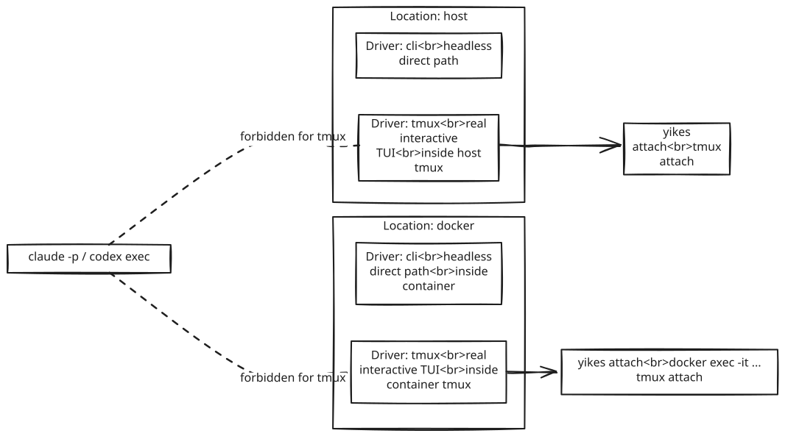
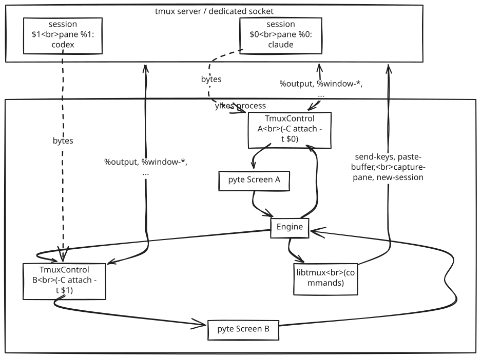
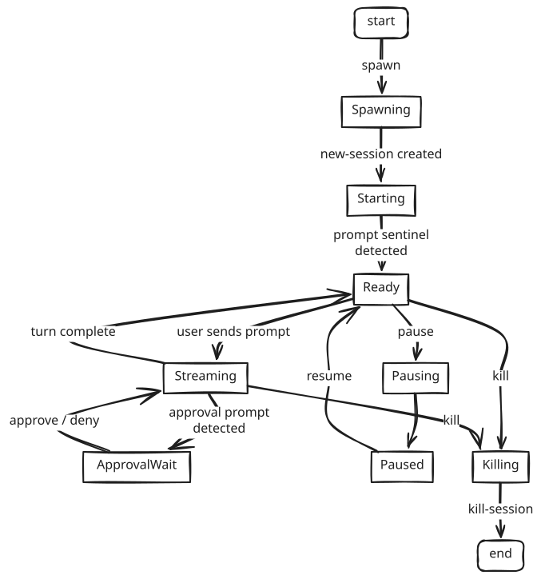

# tmux Layer

The tmux layer is what makes "run Claude/Codex as a real interactive TUI and overtake it later" possible. It owns the lifecycle of a managed tmux server, the panes that host AI sessions, and the byte stream that flows out of them.

tmux is a transport, not a replacement for the runtime. A local `driver=tmux` session starts `claude` or `codex` in a host tmux pane. A Docker session with `tmux_enabled=True` starts `claude` or `codex` inside tmux in the container and is overtaken with `docker exec -it <container> tmux -S <socket> attach -t <session>`.

The tmux transport must never use headless commands. In tmux, Claude starts as `claude ...`; Codex starts as `codex --no-alt-screen ...`. `claude -p`, `codex exec`, and other one-shot paths belong only to the `direct` runtime.

<p align="center"></p>

## Design principles

1. **Dedicated socket.** We never use the user's default tmux server. A separate `-L yikes` (or `-S /path`) socket keeps our sessions out of the user's `tmux ls`, and a `-f /dev/null` config ignores their `~/.tmux.conf`.
2. **Stable IDs over names.** Always target by `$<n>` (session), `@<n>` (window), `%<n>` (pane). Names change; IDs don't.
3. **Hybrid I/O.** **Control mode** (`tmux -C attach`) for the event substrate (low-latency `%output` notifications), **`capture-pane`** for on-demand snapshots, **`send-keys` / `paste-buffer`** for input.
4. **One pyte per pane.** The VT emulator runs in our process and consumes `%output` bytes; we never re-parse from tmux's grid (which is already collapsed).
5. **One stream tap per observed pane.** A control-mode client only receives `%output` for the session/window it is attached to. The driver can keep one tmux server, but it must open one control client per live session that needs streaming.

## Topology

<p align="center"></p>

- One dedicated tmux server owns all managed sessions.
- One `tmux -C attach -t <session-id>` subprocess is opened per pane/session that needs live streaming. A single control client does **not** multiplex output from inactive sessions; it only emits `%output` for the session it is currently attached to.
- `libtmux` issues commands (low frequency, synchronous request/response).
- Each pane gets its own pyte `Screen` in our process; pyte's `dirty` set drives our `LineRevised` events.

## Workspaces

When the caller passes an explicit `cwd`, tmux starts there and yikes! does not auto-confirm trust prompts. A user can attach and approve or deny with the native CLI.

When no `cwd` is passed, tmux-backed sessions receive a generated workspace:

- local tmux: a random host directory such as `/tmp/yikes-tmux-*`
- Docker+tmux: a random container directory such as `/workspace/session-<id>`

Generated workspaces are intentionally empty yikes!-owned roots, so the startup trust prompt can be confirmed automatically. This avoids accidentally treating the caller's current host directory as trusted. Docker+tmux does not mount the host cwd in this case.

## Overtake / Attach

Every tmux-backed session records enough metadata to produce an attach command:

```bash
yikes sessions
yikes attach <session-id> --print-only
```

Local tmux attach looks like:

```bash
tmux -S /path/to/yikes.sock attach -t yikes-claude-...
```

Docker+tmux attach looks like:

```bash
docker exec -it yksb-... tmux -S /workspace/yikes-tmux.sock attach -t yikes-codex
```

This is the "real overtake" path: the human terminal attaches to the same pane that yikes! created. The CLI process may crash or exit; the tmux session and Docker container can continue running until explicitly closed.

Inside the terminal UI, the same capabilities are exposed without making users remember tmux commands:

- `/key <key>` sends one tmux key to the selected session. Examples: `/key Down`, `/key Up`, `/key Enter`, `/key Escape`, `/key C-c`.
- `/paste <text>` loads text into a tmux buffer and pastes it into the selected session.
- `/view extracted` shows yikes!' parsed answer; `/view full` shows captured terminal output when a backing tmux session can be resolved.
- `/term` opens an interactive terminal attach to the tmux session.

Developer diagnostics are opt-in. Setting `YIKES_DEVELOPER_MODE=1` or `YIKES_TMUX_IO_LOG=1` enables a bounded JSONL ring buffer under `~/.yikes/debug/tmux-io` that records tmux paste input, key input, resize control events, and captured output. The logger is size-limited per file and across the directory, so it can be left on briefly while reproducing UI/session recovery bugs without growing indefinitely.
- `/fullscreen` overtakes the session with the same interactive attach while hiding the yikes! composer/sidebar. While attached, all input goes directly to Claude/Codex except `Ctrl-b`, which yikes! reserves as the return-to-yikes escape.

The fullscreen escape intentionally avoids double-Escape. Escape is not a safe global escape hatch in terminal applications because cursor keys and many application-level shortcuts are encoded as escape sequences. Browser and CLI attach surfaces also show a visible return control where the UI allows it.

## Lifecycle

<p align="center"></p>

Every state transition emits an engine event so callers can observe lifecycle.

## Operations exposed to the engine

The tmux driver presents this internal API:

```python
class TmuxDriver(Driver):
    socket_path: Path = Path.home() / ".yikes" / "tmux" / "default.sock"
    base_config: Path = Path("/dev/null")

    async def spawn(self, *, name: str, argv: list[str],
                    env: dict[str, str], cwd: Path,
                    cols: int = 200, rows: int = 50) -> PaneHandle: ...

    async def list(self) -> list[PaneHandle]: ...
    async def get(self, session_id: str) -> PaneHandle | None: ...
    async def kill(self, session_id: str) -> None: ...
    async def kill_all(self) -> None: ...                # kill-server on our socket
    async def kill_orphans(self, *, max_age: float | None = None) -> int: ...

    async def attach_command(self, session_id: str) -> list[str]:
        """Return the argv a human can use to attach with their own tmux client."""
        ...

    async def stream(self, pane: PaneHandle) -> AsyncIterator[bytes]: ...
    async def snapshot(self, pane: PaneHandle, *, with_ansi: bool = False) -> str: ...

    async def send_text(self, pane: PaneHandle, text: str,
                        *, bracketed_paste: bool = False) -> None: ...
    async def send_key(self, pane: PaneHandle, key: str) -> None: ...
    async def send_keys(self, pane: PaneHandle, keys: list[str]) -> None: ...

    async def resize(self, pane: PaneHandle, cols: int, rows: int) -> None: ...
```

This is what gets called by both `claude` and `codex` adapters when their driver is `tmux`. The verbs (`kill_all`, `list`, `attach_command`) flow up to the CLI as `yikes ps`, `yikes kill`, `yikes attach`.

## Isolation

`/dev/null` config + explicit options keeps the wrapper deterministic regardless of the user's tmux config:

```bash
tmux -S ~/.yikes/tmux/default.sock -f /dev/null new-session -d -s ai_$$ -x 200 -y 50 \
    -P -F '#{session_id} #{pane_id}' \
    -e TERM=tmux-256color \
    -e LANG=en_US.UTF-8 \
    -e LC_CTYPE=en_US.UTF-8 \
    -c "$PWD" \
    "claude --permission-mode dontAsk"

tmux -S ~/.yikes/tmux/default.sock set -g default-terminal "tmux-256color"
tmux -S ~/.yikes/tmux/default.sock set -g status off
tmux -S ~/.yikes/tmux/default.sock set -g history-limit 100000
tmux -S ~/.yikes/tmux/default.sock set -as terminal-features ',xterm*:sync'   # pass-through DECSET 2026
tmux -S ~/.yikes/tmux/default.sock set -g extended-keys off                    # avoid csi-u paste bug
```

Use `-S` with a socket path under a `0700` `~/.yikes/tmux/` directory by default. `-L yikes` remains a debugging shorthand, but a fixed global socket name collides across projects, users running multiple yikes versions, and stale servers.

!!! danger "Why this matters"
    With `extended-keys-format csi-u` enabled (a common modern tmux setting), CR/LF inside a bracketed paste block gets re-encoded as CSI-u sequences that Claude Code's paste tokeniser silently drops — collapsing your multi-line prompt to a single line ([claude-code#43169](https://github.com/anthropics/claude-code/issues/43169)).

## Sending input

### Literal text vs named keys

Two distinct calls, never mixed:

```python
# wrong — tmux interprets {, #, "Enter", "$"
await tmux("send-keys", "-t", pane, f"let x = 1; echo $x Enter")

# right — separate literal payload from control keys
await tmux("send-keys", "-t", pane, "-l", "let x = 1; echo $x")
await tmux("send-keys", "-t", pane, "Enter")
```

The driver enforces this at the API level: `send_text()` uses `-l`, `send_key()` uses the named-key path.

### Multi-line prompts via bracketed paste

```python
async def send_text(self, pane, text, *, bracketed_paste=False):
    if bracketed_paste:
        buf = f"yikes_{pane.id}"
        await tmux("load-buffer", "-b", buf, "-")  # stdin = text
        await tmux("paste-buffer", "-p", "-d", "-b", buf, "-t", pane.id)
    else:
        # split on '\n', emit literal+Enter for each line — only useful for shells
        for line in text.splitlines():
            await tmux("send-keys", "-t", pane.id, "-l", line)
            await tmux("send-keys", "-t", pane.id, "Enter")
```

`-p` wraps the paste in bracketed-paste markers (`ESC[200~ ... ESC[201~`). Claude Code, Codex, and any modern TUI prompt treat that as raw content, not as submission.

`-d` deletes the buffer after pasting (avoid leaking secrets in tmux's buffer list).

After pasting, yikes! submits Claude with `C-m`. Codex's multi-line composer can keep an image-bearing draft in the input box after only one submit key, so yikes! sends `C-j` followed by `C-m` for Codex tmux sessions.

### Timing

We do **not** insert fixed sleeps. Instead, the driver waits for sentinels:

1. **Shell readiness** — if the pane is hosting a shell that launches the AI (uncommon — we usually launch the AI directly), wait for an echoed marker.
2. **TUI readiness** — wait for a known prompt glyph in the bottom rows via `capture-pane`. For Claude Code: `│ >`; for Codex: `╭───`. Configurable.

```python
async def wait_for_prompt(self, pane, *, timeout=10.0):
    async with asyncio.timeout(timeout):
        while True:
            text = await self.snapshot(pane, rows=-5)
            if self.adapter.is_prompt_ready(text):
                return
            await asyncio.sleep(0.05)
```

## Reading output

### Why control mode for the stream

The alternative is polling `capture-pane`. Bad idea:

- `capture-pane` returns the *current rendered grid*. Spinner redraws have collapsed by the time we look. We lose intermediate tokens.
- Each `capture-pane` is a fork+exec — ~5–12 ms — so polling at 20 Hz costs a CPU.

Control mode (`tmux -C attach -t <session-id>`) delivers `%output %P data` notifications as bytes are written for the attached session. We never miss intermediate state for that pane, and the cost is one open pipe per observed session.

The important limitation: control mode follows the attached client. In a server with sessions `$0` and `$1`, a control client attached to `$0` sees `%output %0 ...`; it will not also see `%output %1 ...` until it switches to `$1`, at which point it stops seeing `%0`. The implementation therefore treats a control-mode subprocess as a **stream tap**, not as a global bus.

### The reader loop

```python
async def _reader(self):
    """Run for the lifetime of one observed pane/session."""
    async for line in self.proc.stdout:
        line = line.rstrip(b'\r\n')
        match line.split(b' ', 2):
            case [b'%output', pane, payload]:
                data = decode_octal(payload)
                await self._panes[pane.decode()].feed(data)
            case [b'%window-close' | b'%pane-exited', target, *_]:
                await self._on_pane_close(target.decode())
            case [b'%pause', wid]:
                await self._panes[wid.decode()].on_pause()
            case [b'%continue', wid]:
                await self._panes[wid.decode()].on_continue()
            case [b'%subscription-changed', name, *rest]:
                await self._on_subscription(name.decode(), rest)
            case [b'%exit', *_]:
                return
```

**`%output` decoding**: tmux replaces every byte `<32` and the backslash byte with three-digit octal escapes. `\033` is ESC, `\012` is LF, `\134` is backslash. The decoder is a small regex replacement.

### Flow control via `refresh-client`

For high-throughput streams (long agent reasoning, large diff dumps) we set this on every stream tap:

```
refresh-client -f pause-after=30
```

so a slow consumer gets a `%pause` event instead of unbounded buffering, then `refresh-client -A '%P:continue'` to resume that pane's tap.

### Snapshots

`snapshot()` calls `capture-pane`:

```bash
tmux -S ~/.yikes/tmux/default.sock capture-pane -p -e -J -S - -E - -t %0
```

- `-p` print to stdout
- `-e` include ANSI
- `-J` join wrapped lines
- `-S - -E -` full scrollback

For a quick "what's on screen right now" we pass `-S -<rows>` to limit cost.

## Session management (cross-cutting)

A first-class requirement: **users can spawn, kill, list, killall sessions uniformly across Claude Code and Codex.**

The tmux driver implements all of these against our socket. The adapter contributes a *label* (`claude` / `codex`) and a *metadata blob* (model, cwd, native session ID) stored as pane environment.

```bash
# Spawn (claude)
tmux -S ~/.yikes/tmux/default.sock new-session -d -s yikes-claude-3f9 -x 200 -y 50 \
    -e YIKES_BACKEND=claude -e YIKES_NATIVE_ID=abc123 \
    -e YIKES_MODEL=opus -e YIKES_CWD=/Users/x/proj \
    -c /Users/x/proj \
    "claude --resume abc123"

# List
tmux -S ~/.yikes/tmux/default.sock list-sessions -F '#{session_id} #{session_name} #{E:YIKES_BACKEND} #{E:YIKES_MODEL}'

# Kill one
tmux -S ~/.yikes/tmux/default.sock kill-session -t '$3'

# Kill all (whole server on our socket)
tmux -S ~/.yikes/tmux/default.sock kill-server
```

Pane environment is propagated to the child via `-e KEY=VALUE`. We use this to tag sessions with their backend and native session ID so `yikes list` can show them.

The command string passed to `new-session` is built from argv with shell-safe quoting (`shlex.join(argv)` in Python). Prompts are not embedded in the spawn command; the adapter waits for readiness and then pastes user content through `send_text()`.

## Pitfalls — checklist

| Pitfall | Mitigation |
|---|---|
| `send-keys` interpreting `$`, `{`, `#`, "Enter" inside literal text | Always `-l` for literal text; named keys in separate call. |
| Multi-line paste collapses to one line | Run our tmux server with `extended-keys-format` unset. |
| Default 80×24 pane reflows TUI | `new-session -x 200 -y 50` + `resize-window -A` to lock. |
| Client attaching changes pane size | Use `resize-window -A` for sticky size. |
| `~/.tmux.conf` interferes | `-f /dev/null` and our explicit `set -g` lines. |
| Fixed `-L yikes` socket collides or attaches to stale server | Default to `-S ~/.yikes/tmux/<instance>.sock`, create parent dir `0700`, verify owner and socket metadata. |
| tmux control client misses output from other sessions | Open one control-mode stream tap per observed session; do not rely on one global `tmux -C attach`. |
| Decoding `%output` payloads | Octal-unescape `\NNN` and `\134` for backslash before feeding pyte. |
| `pipe-pane -o` toggle in scripts | Always explicit start/stop, never toggle. |
| Echo race (our input shows up in output stream) | We track `send_text` calls and filter the echoed bytes by offset, or set `stty -echo` for non-TUI commands. |
| Sending before TUI is ready | Sentinel-wait; never sleep arbitrarily. |
| TUI uses alternate screen → scrollback lost | Pass `--no-alt-screen` to codex; Claude Code already uses primary screen for most output. |
| Approving the wrong modal after a redraw | Re-read the bottom rows immediately before sending approval keys and compare against the stored prompt fingerprint. |
| Remote/local path mismatch for images and `@path` references | Host tmux uses local paths directly. Docker tmux copies images into `/workspace/yikes-attachments/` before pasting. Future remote hosts must copy or reject local-only paths before pasting. |
| UTF-8 and wide glyph drift between tmux and pyte | Set `LANG`/`LC_CTYPE`, test wide glyph fixtures, and verify `tmux-256color` terminfo exists. |
| Subprocess fork overhead for `capture-pane` polling | Don't poll — use `%output`. `capture-pane` only for on-demand snapshots. |

## When the driver gives up

- Cannot reach tmux binary → `TmuxUnavailable` exception; engine offers `direct` driver instead.
- Cannot create socket → permission / path error, surfaced with the actual error.
- Pane dies unexpectedly → `Stopped(reason="pane_dead", exit_code=...)` event; transcript is preserved.
- Approval-prompt detection fails (modal moved) → falls through to a generic `LineRevised` event so the caller still sees something happened. We log a warning and the test suite catches the regression next CI run.
